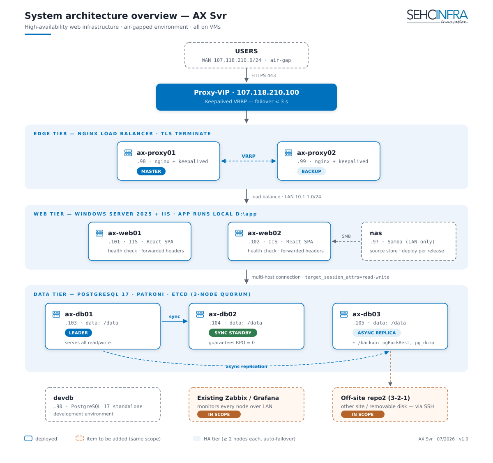
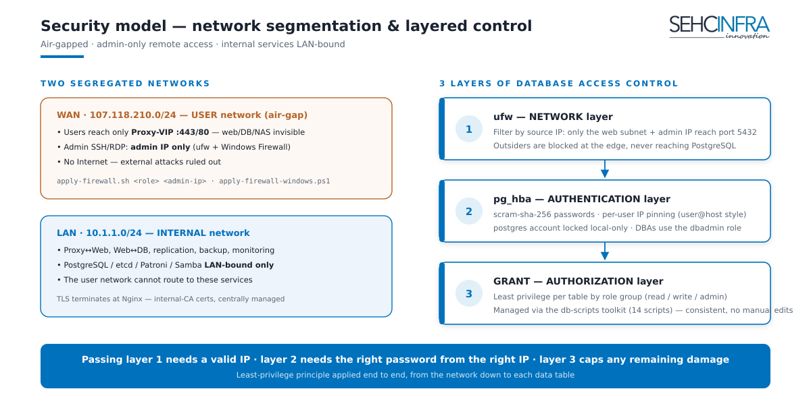
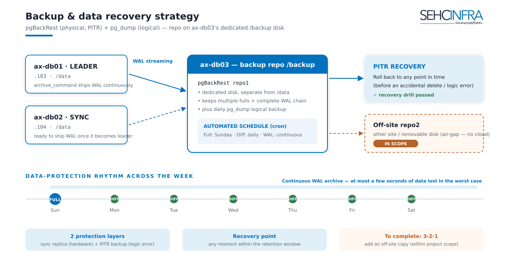
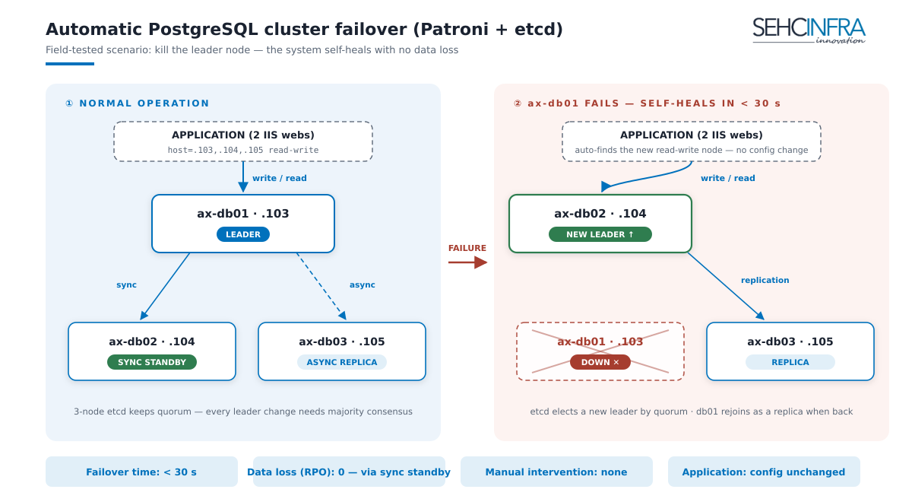

# PROJECT PROPOSAL & REPORT — "AX SVR" HIGH-AVAILABILITY WEB INFRASTRUCTURE

> **Document type:** Internal proposal — for management
> **Date:** 2026-07-10
> **Project status:** Core infrastructure fully deployed (production)
> **Delivered by:** Infrastructure team

---

## 1. Executive summary

The AX Svr project builds a complete **High Availability (HA)** web infrastructure for the client on a virtualization platform, inside an **air-gapped** network (isolated, no Internet access). The system is designed around the principle of **no single point of failure (SPOF)** at any tier:

- **Edge tier:** 2 Nginx proxies + Keepalived/VIP — lose one proxy and traffic fails over in **< 3 seconds**.
- **Web tier:** 2 IIS servers (Windows Server 2025) running in parallel behind the load balancer — lose one web node and Nginx drops it from the pool.
- **Data tier:** a 3-node PostgreSQL 17 cluster (Patroni + etcd) automatically elects a new leader in **< 30 seconds** when the primary fails, with one synchronous replica guaranteeing **no committed data is lost (RPO = 0)**.
- **Data safety:** pgBackRest backup with continuous WAL, supporting point-in-time recovery (PITR).

Deliverables include: **10 deployed VMs**, ~2,400 lines of operations documentation (10 phase documents), a DB administration toolkit (14 scripts), role-based firewall automation scripts, and an automated installation ISO builder. Everything is version-controlled in Git (tag v1.0.0).

**Within the same project scope (delivered as one phase, not split into a phase 2):** integrate monitoring into the company's **existing Zabbix/Grafana** platform (no dedicated monitoring node), add off-site backup to complete the 3-2-1 standard, and establish a recurring failover/recovery drill schedule.

---

## 2. Context & objectives

### Context
The client needs infrastructure to run a web application (React SPA + a PostgreSQL backend) serving internal users over a private network, with these requirements:
- **Uninterrupted** service when any single server fails.
- **No data loss** when a database node fails.
- **Air-gapped** environment: no Internet — every solution must work offline.
- Only administrators may access servers remotely.

### Committed objectives
| Objective | Metric | Result |
|---|---|---|
| Proxy-tier HA | VIP failover | < 3 seconds |
| Web-tier HA | Drop a failed node from the pool | Automatic (health check) |
| DB-tier HA | Elect a new leader | < 30 seconds, automatic |
| Data-loss protection | RPO on leader loss | = 0 (sync replica) |
| Data recovery | PITR | To any point in time |
| Security | Remote access | Admin IP only (ufw + Windows FW) |

---

## 3. Solution architecture

### 3.1 System overview

### 3.2 Key architecture decisions & rationale

1. **2 proxies + Keepalived/VIP (active-passive)** — edge HA with a single IP for users; automatic failover via VRRP, no dedicated load-balancer appliance needed.
2. **Patroni + etcd 3-node DB cluster** — industry-standard PostgreSQL auto-failover; odd quorum avoids split-brain; 1 sync standby (RPO=0) + 1 async replica.
3. **The application connects to the DB via a multi-host connection string** (`target_session_attrs=read-write`) instead of HAProxy/DB-VIP — **one fewer middle layer, one fewer point of failure**, with equivalent data safety (Patroni handles failover).
4. **Web runs locally (`D:\app`), NAS is only a source store** — if the NAS fails the web keeps running; this avoids making the NAS a SPOF. Deployment is per versioned release, with rollback.
5. **Backup centralized on ax-db03's dedicated `/backup` disk** — weekly full + daily differential + continuous WAL streaming; plus a pg_dump logical backup. (Limitation & mitigation: see section 6.)
6. **TLS terminates at Nginx** — certificates managed centrally in one place; IIS runs HTTP internally on the LAN.
7. **Air-gap compliance** — every installation guide has an offline path (APT mirror, internal CA, internal NTP).

### 3.3 Security — layered model

- **Two segregated networks:** WAN (user access) / LAN (replication, backup, internal administration). PostgreSQL, etcd, Patroni, and Samba are **LAN-bound only**.
- **Role-based firewall:** `apply-firewall.sh` (Linux/ufw) + `apply-firewall-windows.ps1` (Windows/RDP) — SSH/RDP **open to admin IPs only**.
- **Three-layer DB control:** ufw (IP filtering) → pg_hba (authentication, per-user IP pinning) → GRANT (per-table privileges). The root `postgres` account is locked local-only; administration uses a dedicated `dbadmin` role.

---

### 3.4 Backup & recovery strategy

## 4. Work completed

### 4.1 Infrastructure deployed (production)

| # | Item | Details |
|---|---|---|
| 1 | 10 VMs fully installed | 2 proxy, 2 web (Win2025), 3 DB, NAS, DevDB + standardized OS / dual-NIC network / hardening |
| 2 | PostgreSQL HA cluster | PostgreSQL 17 + Patroni + etcd 3 nodes, 1 sync + 1 async, data on a dedicated `/data` disk |
| 3 | IIS web tier | 2 Win2025 nodes, SPA routing, health check, forwarded headers |
| 4 | Proxy HA tier | Nginx LB + Keepalived VIP, upstream health check |
| 5 | NAS source store | Samba LAN-bound, per-release NAS→local deployment workflow |
| 6 | Backup | pgBackRest (full/diff/WAL) + pg_dump, cron on ax-db03, dedicated `/backup` disk |
| 7 | System-wide firewall | Role-based ufw + Windows Firewall, admin-only remote access |
| 8 | DevDB | Standalone PostgreSQL 17 for the dev team |

> **Monitoring note:** the Phase 6 document (Prometheus/Grafana) is complete, but **no dedicated monitoring node was built** — the decision is to leverage the company's **existing Zabbix/Grafana** platform (see section 7).

### 4.2 Deliverables

| Deliverable | Scope |
|---|---|
| Deployment & operations documentation (Phase 0→6, DevDB, off-site, autoinstall) | 10 documents, ~2,400 lines, per-node config separated (copy-paste ready) |
| PostgreSQL administration toolkit `db-scripts/` | 14 scripts: create admin/user/db, group privileges, per-user IP pinning, supports both DevDB & the Patroni cluster |
| Firewall automation scripts | 2 scripts (Linux + Windows) |
| Ubuntu 24.04 autoinstall tool | `gen-autoinstall.sh` generates a seed ISO per host |
| Go-Live acceptance checklist | Complete per tier, including real node-failure tests |
| Version control | Private Git repo, tag **v1.0.0** |

### 4.3 HA test results (per acceptance checklist)

- Kill the DB leader → the cluster elects a new leader in **< 30 seconds**, the application keeps writing normally; the old node rejoins as a replica when restarted.
- Kill the primary proxy → the VIP moves to the standby proxy in **< 3 seconds**, users are not interrupted.
- Kill one web node → Nginx drops it from the pool, service continues on the remaining node.
- Backup: WAL archiving runs continuously; the PITR recovery drill passed successfully.

---

## 5. Value delivered

1. **No SPOF at any tier** — any single server can fail and service keeps running; unplanned downtime is minimized.
2. **Two layers of data safety** — sync replica (RPO=0 on leader loss) + PITR backup (recover from logic mistakes and accidental deletes).
3. **Simplified operations** — failover is fully automatic across all three tiers, with no manual intervention during an incident.
4. **Knowledge documented** — any engineer can operate or rebuild the system from the runbook; no dependence on a single individual.
5. **Reusable** — the documentation + scripts form a standard baseline for deploying to future clients with similar needs.

---

## 6. Remaining risks & current limitations

| # | Risk / limitation | Severity | Mitigation |
|---|---|---|---|
| 1 | Backup currently sits on ax-db03 — the same cluster as the primary data. A disaster that loses the whole cluster (fire, virtualization storage failure) would lose the backup too | **High** | Add off-site backup (another site / removable disk — cloud is unavailable in an air-gap) → complete the 3-2-1 standard. Documentation already written (`axsvr-backup-offsite.md`) |
| 2 | No centralized monitoring/alerting yet — a single-node failure (the system keeps running thanks to HA) may go unnoticed until the second node fails | **High** | Integrate the existing Zabbix/Grafana (section 7.1) |
| 3 | HA only holds when same-role VMs sit on **different physical hosts** (anti-affinity) | Medium | Confirm anti-affinity configuration at the virtualization layer |
| 4 | TLS certificates use an internal CA — a renewal/CA-distribution process is needed for clients | Medium | Fold into the recurring operations process |
| 5 | Patroni/pgBackRest operational skills must be maintained | Medium | Recurring failover + PITR drills (quarterly) per the existing checklist |

---

## 7. Completion items — delivered as one phase

The items below belong to the **same project scope** and are executed in **a single pass** (not split into a phase 2) to reach full safety and operational maturity:

### 7.1 Integrate monitoring into the existing Zabbix/Grafana *(high priority)*
No dedicated monitoring node; leverage the monitoring infrastructure the company already runs:
- Install the Zabbix agent on the Linux/Windows nodes; monitor per-tier ports/services (nginx, keepalived, IIS, postgres, patroni, etcd).
- Monitor cluster state via the Patroni REST API (`:8008/metrics`) and etcd health.
- Minimum alerts: node down, cluster loses leader / loses sync standby, backup failed/overdue, `/data` and `/backup` disk usage, certificate nearing expiry.
- Grafana dashboards for the DB cluster + proxy traffic.

### 7.2 Off-site backup — complete 3-2-1 *(high priority)*
Deploy a pgBackRest repo2 to another site over SSH (or a removable-disk procedure) per the existing `axsvr-backup-offsite.md` document.

### 7.3 Recurring operations process
- DB + proxy failover drills, PITR recovery drills: quarterly.
- Check `pgbackrest info`, disk usage, certificate expiry: weekly (automated once 7.1 is in place).
- OS security updates via the offline APT mirror: on the company's defined cycle.

### 7.4 Resources to complete (one phase)
| Item | Estimate |
|---|---|
| Zabbix/Grafana integration (7.1) | 3–5 person-days |
| Off-site backup (7.2) | 2–3 person-days + secondary-site / removable-disk hardware |
| Set up the schedule & run the first drills (7.3) | 1–2 person-days |
| **Total** | **~6–10 person-days, done in one pass** |

---

## 8. Conclusion

The AX Svr infrastructure is fully deployed, meets the committed HA and data-safety objectives, and ships with complete operations documentation and administration tooling. The system currently serves reliably; the two items needed to reach full safety are **Zabbix/Grafana monitoring integration** and **3-2-1 off-site backup**.

We ask management to:
1. **Accept** the completed work (section 4).
2. **Approve completion** of the remaining items (section 7) — executed **within a single phase**, ~6–10 person-days total.

---

## Appendix A — System IP table

| Component | WAN 107.118.210.x | LAN 10.1.1.x | OS / software |
|---|---|---|---|
| Proxy-VIP | .100 | — | (Keepalived VRRP) |
| ax-proxy01 | .98 | .98 | Ubuntu / nginx, keepalived |
| ax-proxy02 | .99 | .99 | Ubuntu / nginx, keepalived |
| ax-web01 | .101 | .101 | Win2025 / IIS |
| ax-web02 | .102 | .102 | Win2025 / IIS |
| nas | .97 | .97 | Ubuntu / samba (web source only) |
| ax-db01 | .103 | .103 | Ubuntu / PostgreSQL 17, Patroni, etcd, pgBackRest |
| ax-db02 | .104 | .104 | same as above |
| ax-db03 | .105 | .105 | same as above + `/backup` disk (backup repo) |
| devdb | .90 | — | Ubuntu / PostgreSQL 17 standalone |

## Appendix B — Deliverable document list

| Phase | Document | Content |
|---|---|---|
| 0 | axsvr-phase0-setup.md | OS, dual-NIC network, hardening, role-based software |
| 1 | axsvr-phase1-db.md | PostgreSQL HA cluster (etcd + Patroni) |
| 2 | axsvr-phase2-nas.md | NAS source store (Samba, per-release deploy) |
| 3 | axsvr-phase3-web-iis.md | Win2025 + IIS web |
| 4 | axsvr-phase4-proxy.md | Proxy HA (Nginx + Keepalived/VIP) |
| 5 | axsvr-phase5-backup.md | pgBackRest + pg_dump backup, PITR |
| 5b | axsvr-backup-offsite.md | Off-site backup (3-2-1) — *in scope, not yet deployed* |
| 6 | axsvr-phase6-monitoring.md | Monitoring (reference; replaced by Zabbix/Grafana integration) |
| Dev | axsvr-devdb-setup.md | DevDB standalone |
| Tool | axsvr-autoinstall.md + autoinstall/ | Ubuntu 24.04 autoinstall (seed ISO) |
| Tool | firewall/ | Role-based firewall (Linux + Windows) |
| Tool | db-scripts/ | 14 PostgreSQL administration scripts |
