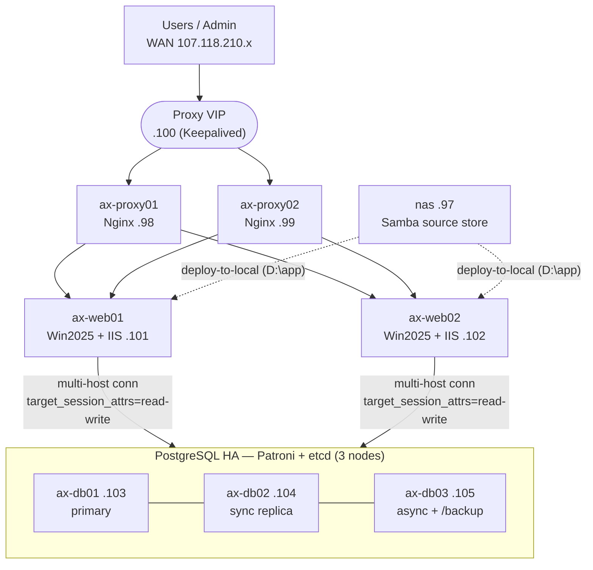

# AX Svr — Infrastructure Overview

> **Audience:** internal engineering (infra / DBA / web).
> **Status:** Production deployed (10 VMs). Last updated 2026-07-18.
> **Source of truth:** private repo `github.com/minh0607/ax-svr-docs` — every command, config, and script referenced here lives under `docs/`. This page is the map; the repo is the territory.

---

## 1. What this is

A fully high-available web platform built entirely on virtual machines. Two load-balanced reverse proxies front two Windows/IIS web servers; a 3-node PostgreSQL cluster with automatic failover holds the data; a NAS serves web source; pgBackRest provides point-in-time backups. The production network is **air-gapped** (no direct internet).

**Design priorities:** no single point of failure at the edge or the database, least-privilege access, and copy-paste-exact runbooks so an operator never has to improvise on an air-gapped box.

---

## 2. Architecture at a glance



- **TLS terminates at Nginx**; IIS runs plain HTTP on the internal LAN.
- **Apps reach the DB via multi-host connection string** (`target_session_attrs=read-write`) — the driver itself finds the current primary. No HAProxy, no database VIP.
- **The web app runs from local disk (`D:\app`)** on each IIS box. The NAS is only a source repository (deploy-to-local); IIS never serves directly off the NAS.

Rendered, English-labeled diagrams (SVG/PNG) are committed under `docs/images/en/` (`axsvr-architecture`, `axsvr-db-failover`, `axsvr-backup`, `axsvr-security`); the Vietnamese versions are in `docs/images/`.

---

## 3. Host inventory

All hosts are VMs with two NICs. The **last octet is consistent across both subnets** — WAN `107.118.210.<n>` (users + admin) and LAN `10.1.1.<n>` (internal traffic).

| Role | Hostname | Last octet | OS | Notes |
|------|----------|-----------|-----|-------|
| Reverse proxy 1 | `ax-proxy01` | .98 | Ubuntu 24.04 | Nginx + Keepalived |
| Reverse proxy 2 | `ax-proxy02` | .99 | Ubuntu 24.04 | Nginx + Keepalived |
| Proxy VIP | — | .100 | — | Floating IP (active-passive) |
| Web 1 | `ax-web01` | .101 | Windows Server 2025 | IIS, app on `D:\app` |
| Web 2 | `ax-web02` | .102 | Windows Server 2025 | IIS, app on `D:\app` |
| DB 1 | `ax-db01` | .103 | Ubuntu 24.04 | Patroni + etcd |
| DB 2 | `ax-db02` | .104 | Ubuntu 24.04 | Patroni + etcd (sync replica) |
| DB 3 | `ax-db03` | .105 | Ubuntu 24.04 | Patroni + etcd (async) + `/backup` |
| NAS | `nas` | .97 | Ubuntu 24.04 | Samba source store |
| Monitoring | `mon` | .96 | — | **Not deployed** (see §8) |
| Dev DB | `devdb` (AX-DevDB-210) | .90 | Ubuntu 24.04 | Standalone PG17, has internet |

Naming convention (fixed): lowercase `ax-<role>0N`; single-purpose boxes keep short names (`nas`, `mon`, `devdb`). For the DB cluster, `Patroni member name = etcd ETCD_NAME = hostname = ax-db0N`.

---

## 4. Components

### 4.1 Edge — Proxy HA
Two Nginx reverse proxies in active-passive with **Keepalived** owning a floating **VIP (.100)**. Nginx terminates TLS and load-balances HTTP to the two IIS backends. If the active proxy fails, the VIP moves to the standby.
→ `docs/axsvr-phase4-proxy.md`

### 4.2 Database — PostgreSQL HA
- **PostgreSQL 17** (via the PGDG repo), **Patroni + etcd across 3 nodes** for automatic failover.
- Topology: 1 primary, 1 **synchronous** replica, 1 **asynchronous** replica.
- All data and logs live under **`/data/postgresql`** (`/data` is a dedicated disk).
- Apps connect with a multi-host connection string and `target_session_attrs=read-write`, so a failover needs no app reconfiguration.
→ `docs/axsvr-phase1-db.md`

### 4.3 Web — Windows / IIS
Two Windows Server 2025 + IIS hosts. The (React/SPA) app is deployed to **local disk `D:\app`**; the NAS holds the canonical source and is pulled to local on deploy. IIS runs HTTP internally (TLS is at the proxy) and is configured for SPA routing, health checks, and forwarded headers.
→ `docs/axsvr-phase3-web-iis.md`

### 4.4 NAS
Single purpose: **serve web source over Samba** (deploy-to-local). It is explicitly **not** a web host and **not** a backup repository.
→ `docs/axsvr-phase2-nas.md`

### 4.5 Backup — pgBackRest (Plan B)
- pgBackRest repository + `pg_dump` on **`/backup` of ax-db03** (a dedicated disk, separate from `/data`).
- DB is < 100 GB → **weekly full + daily differential + continuous WAL archiving** (PITR).
- Off-site (cloud S3 / SSH) is the documented upgrade path to a full 3-2-1 posture (`repo2`).
→ `docs/axsvr-phase5-backup.md`, `docs/axsvr-backup-offsite.md`

### 4.6 DevDB
Standalone PostgreSQL 17 for the dev team, data on `/data`. Unlike production it **has internet** (installs PGDG online normally).
→ `docs/axsvr-devdb-setup.md`

---

## 5. Security model

### 5.1 Network / access
- **Air-gapped production** (no internet): needs an offline APT mirror, an internal CA, and internal NTP.
- **Remote access is admin-only**, enforced by firewall scripts by role: `firewall/apply-firewall.sh` (ufw — SSH restricted to admin IPs) and `firewall/apply-firewall-windows.ps1` (RDP restricted to admin IPs).

### 5.2 Database — three layers of control
Every DB connection must pass **all three** (AND, not OR):

| Layer | Mechanism | Controls |
|-------|-----------|----------|
| 1 | **ufw** | which IP may reach port 5432 |
| 2 | **pg_hba** | which user, from which IP, with which password |
| 3 | **GRANT / role membership** | which schema + which table the user may touch |

- The built-in `postgres` superuser is **local-only**; DBAs use a dedicated `dbadmin` superuser for remote administration.
- Per-user IP pinning (MySQL-style `user@host`) is applied through `pg_hba` — see the `bind-ip` tool below.

---

## 6. Database administration toolkit (`docs/db-scripts/`)

Two entry points, same capabilities:
- **`axdb.sh`** — one self-contained script; run with no arguments for an interactive menu, or `axdb.sh <command> [args]`.
- **Standalone scripts** (`create-schema.sh`, `grant-table.sh`, `setup-group-roles.sh`, …) for scripting/automation.

Both honor a `PSQL_ADMIN` override so they work locally (`sudo -u postgres psql`) or remotely (`export PSQL_ADMIN="psql -h 107.118.210.90 -U dbadmin"`).

### 6.1 The access model — schema-per-app

Three layers, never mixed:

```
1 person        = 1 login role (NOT a superuser, no shared accounts)
                    ↓ member of
1 permission set = a group role: <schema>_readonly / <schema>_readwrite
                    ↓ applied to
1 application    = 1 schema (finance, hr, licasi, …)
```

**Rules that make this hold:**
- One app = one **schema** (a namespace inside the database). Tables get grouped and secured per app instead of piling into `public` with name prefixes.
- Privileges live on **group roles**, not on individuals. Onboarding = create a login role + `grant-group`; offboarding = drop the role. Tables and grants are never touched.
- **Always create tables as the schema/DB owner** — `ALTER DEFAULT PRIVILEGES ... FOR ROLE <owner>` only auto-grants future tables to the groups when the owner is the creator. (Creating tables as a different role is the #1 cause of "I made a table but nobody can read it".)
- Cross-project access = add a group membership, e.g. a Production account that needs to read all of Finance: `GRANT finance_readonly TO prod_acc;` — covers existing **and future** Finance tables. Cross-schema queries must qualify the schema: `SELECT * FROM finance.fi_cost;`.

**Caveat:** group roles are cluster-global. Reusing the same schema name in two different databases makes them share one group role — fine within one database; qualify group names per-DB if you ever need the same schema name across databases.

### 6.2 Command reference

| Task | Command |
|------|---------|
| Create an app schema + its RO/RW groups | `./axdb.sh schema <app> <db> [owner]` |
| Create a login user (optionally in a group) | `./axdb.sh create-user <user> [group]` |
| Add / remove a user to a group | `./axdb.sh grant-group <user> <group>` · `revoke-group` |
| Set a user's search_path (so app code needs no schema prefix) | `./axdb.sh set-search-path <user> <schema>` |
| Grant on a table (auto-grants USAGE on its schema) | `./axdb.sh grant <role> <db> <table> "<privs>"` |
| Permission overview | `./axdb.sh perm <db>` (summary) · `perm <db> <user>` (per-table) |
| Move a table into a schema (name kept) | `./axdb.sh set-schema <db> <table> <schema>` |
| Rename table / schema / user | `./axdb.sh rename-table` · `rename-schema` · `rename-user` |
| Pin a user to specific IPs | `./axdb.sh bind-ip <user> <ip[,ip2]>` |
| Reset a role's password | `./axdb.sh passwd <role>` |
| Drop schema / user / db (guarded) | `./axdb.sh drop-schema` · `drop-user` · `drop-db` |

Notes:
- **`grant` auto-adds `USAGE` on the target table's schema** — PostgreSQL needs both USAGE on the schema *and* a table privilege; without USAGE you get `permission denied for schema x` even though `\dp` shows the grant. `revoke` deliberately leaves USAGE in place (the role may still need it for other tables).
- **`rename-schema`** also renames its `<name>_readonly/_readwrite` groups and patches the `search_path` of roles pointing at the old schema. **`rename-user`** also migrates the user's `bind-ip` pg_hba pin. Renames do **not** update application code / connection strings — do that yourself.

### 6.3 Testing
The toolkit ships an automated test suite (11 files) that runs against an ephemeral **PostgreSQL 17 Docker** container via the `PSQL_ADMIN` override — no local Postgres needed:
```bash
for t in docs/db-scripts/tests/test-*.sh; do bash "$t"; done
```

---

## 7. Common operations

**Onboard an app + its first user**
```bash
./axdb.sh schema finance AXDEV dbadmin        # schema + finance_readonly / finance_readwrite
./axdb.sh create-user fi_user finance_readwrite
./axdb.sh set-search-path fi_user finance     # queries need no "finance." prefix
./axdb.sh bind-ip fi_user 10.1.1.50           # optional: pin to an IP
```

**Give a user read access to another project**
```bash
./axdb.sh grant-group prod_acc finance_readonly     # all Finance tables, incl. future ones
# cross-schema queries must qualify: SELECT * FROM finance.fi_cost;
```

**Audit who can touch what**
```bash
./axdb.sh perm AXDEV            # every login user, groups, schema access
./axdb.sh perm AXDEV fi_user    # every table fi_user can reach + privileges
```

**Move an existing table into a schema without breaking the app** — see the worked runbook `docs/db-scripts/runbook-schema-migration.md` (used to migrate the `licasi_*` tables from `public` into a `licasi` schema, keeping table names so app code was unchanged).

---

## 8. Deployment status & open items

**Deployed (10 VMs):** 2 proxy, 2 web, 3 DB, NAS, DevDB — production is live.

**Monitoring:** the `mon` node was **not** built. The company's **existing Zabbix/Grafana** is used instead; `docs/axsvr-phase6-monitoring.md` (Prometheus/Grafana) is kept as reference only.

**Open items:**
- Integrate the cluster into the company Zabbix/Grafana.
- Off-site backup (`repo2`) to complete a 3-2-1 posture — Phase 5b.

---

## 9. Repository map

| Area | Location |
|------|----------|
| Phase 0 — OS / network / hardening / autoinstall | `docs/axsvr-phase0-setup.md`, `docs/axsvr-autoinstall.md` |
| Phase 1 — PostgreSQL HA (etcd + Patroni) | `docs/axsvr-phase1-db.md` |
| Phase 2 — NAS | `docs/axsvr-phase2-nas.md` |
| Phase 3 — Web / IIS | `docs/axsvr-phase3-web-iis.md` |
| Phase 4 — Proxy HA | `docs/axsvr-phase4-proxy.md` |
| Phase 5 — Backup + off-site | `docs/axsvr-phase5-backup.md`, `docs/axsvr-backup-offsite.md` |
| Phase 6 — Monitoring (reference) | `docs/axsvr-phase6-monitoring.md` |
| DevDB | `docs/axsvr-devdb-setup.md` |
| DB toolkit | `docs/db-scripts/` (see its `README.md`) |
| Firewall scripts | `docs/firewall/apply-firewall.sh`, `apply-firewall-windows.ps1` |
| Architecture diagrams (EN / VI) | `docs/images/en/` · `docs/images/` |

---

### Confluence upload notes
- Paste this Markdown into a Confluence page (editor Markdown autoformat, or the *Markdown* macro).
- The `mermaid` block in §2 renders only if your Confluence has a Mermaid/diagram macro — otherwise attach the committed English diagram `docs/images/en/axsvr-architecture.png` as a picture.
- Tables, headings, and code blocks convert cleanly on paste.
