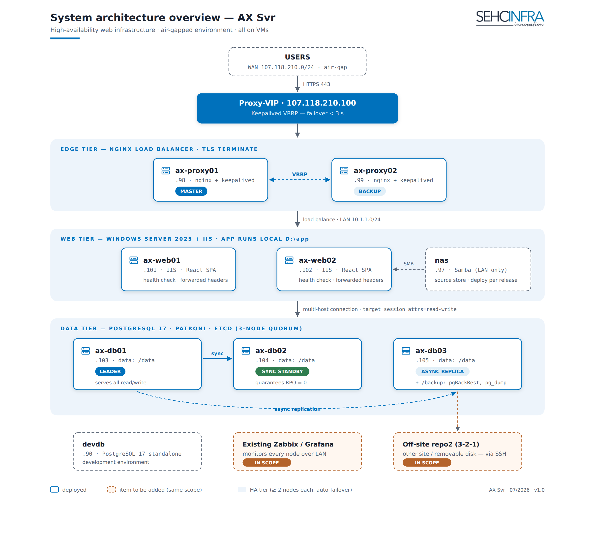
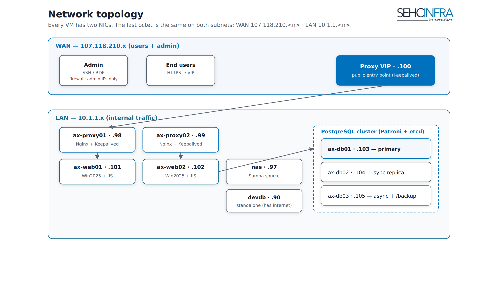

# AX Svr — Architecture & Network

> **Source:** `docs/README.md`, `docs/axsvr-phase0-setup.md` · **Status:** Production deployed (10 VMs).

A fully high-available web platform built entirely on virtual machines. Two load-balanced reverse proxies front two Windows/IIS web servers; a 3-node PostgreSQL cluster with automatic failover holds the data; a NAS serves web source; pgBackRest provides point-in-time backups. Production is **air-gapped** (no direct internet). Design priorities: **no single point of failure** at the edge or the database, **least-privilege** access, and **copy-paste-exact runbooks** so an operator never has to improvise on an air-gapped box.

> Upload `docs/images/en/axsvr-architecture.png` as a Confluence attachment for this page.

## Request flow (big picture)

1. Users hit the **proxy VIP (.100)** over HTTPS.
2. **Nginx terminates TLS** and HTTP-load-balances to the two IIS backends on the LAN.
3. IIS serves the app from **local disk `D:\app`** (source deployed from the NAS).
4. The app connects to PostgreSQL with a **multi-host connection string** (`target_session_attrs=read-write`) — the driver finds the current primary itself; a database failover needs no app change.

Key edge facts: TLS ends at Nginx (IIS runs plain HTTP internally); there is **no HAProxy and no database VIP** — HA at the DB layer is handled by Patroni + a smart connection string.

## Network topology

> Upload `docs/images/en/axsvr-network.png` as a Confluence attachment.

Every VM has **two NICs**. The **last octet is identical on both subnets**:

- **WAN** `107.118.210.<n>` — users + admin access.
- **LAN** `10.1.1.<n>` — internal service traffic.

## Host inventory

| Role | Hostname | Last octet | OS | Notes |
|------|----------|-----------|-----|-------|
| Reverse proxy 1 | `ax-proxy01` | .98 | Ubuntu 24.04 | Nginx + Keepalived |
| Reverse proxy 2 | `ax-proxy02` | .99 | Ubuntu 24.04 | Nginx + Keepalived |
| Proxy VIP | — | .100 | — | Floating IP (active-passive) |
| Web 1 | `ax-web01` | .101 | Windows Server 2025 | IIS, app on `D:\app` |
| Web 2 | `ax-web02` | .102 | Windows Server 2025 | IIS, app on `D:\app` |
| DB 1 | `ax-db01` | .103 | Ubuntu 24.04 | Patroni + etcd (primary) |
| DB 2 | `ax-db02` | .104 | Ubuntu 24.04 | Patroni + etcd (sync replica) |
| DB 3 | `ax-db03` | .105 | Ubuntu 24.04 | Patroni + etcd (async) + `/backup` |
| NAS | `nas` | .97 | Ubuntu 24.04 | Samba source store |
| Monitoring | `mon` | .96 | — | **Not deployed** — uses company Zabbix/Grafana |
| Dev DB | `devdb` (AX-DevDB-210) | .90 | Ubuntu 24.04 | Standalone PG17, has internet |

## Naming convention (fixed)

- Clustered/paired hosts: lowercase `ax-<role>0N` — `ax-proxy01/02`, `ax-web01/02`, `ax-db01/02/03`.
- Single-purpose boxes keep short names: `nas`, `mon`, `devdb`.
- For the DB cluster: **Patroni member name = etcd `ETCD_NAME` = hostname = `ax-db0N`**.

## Key decisions

- **VMs everywhere** — uniform provisioning, snapshots, and portability over bare metal.
- **Dual-NIC WAN/LAN split** — public entry and admin on WAN; all service traffic on an isolated LAN.
- **Air-gapped production** — no internet by design; requires an offline APT mirror, an internal CA, and internal NTP (see the Security page).
- **HA at both tiers** — edge via Keepalived VIP, database via Patroni; no tier has a single point of failure.

## Related pages
Proxy HA · Database HA · Web / IIS · NAS · Backup · Security · Database Toolkit · DevDB · Operations

---
*Confluence: paste as Markdown; upload the two referenced PNGs (`axsvr-architecture.png`, `axsvr-network.png`) as page attachments.*
