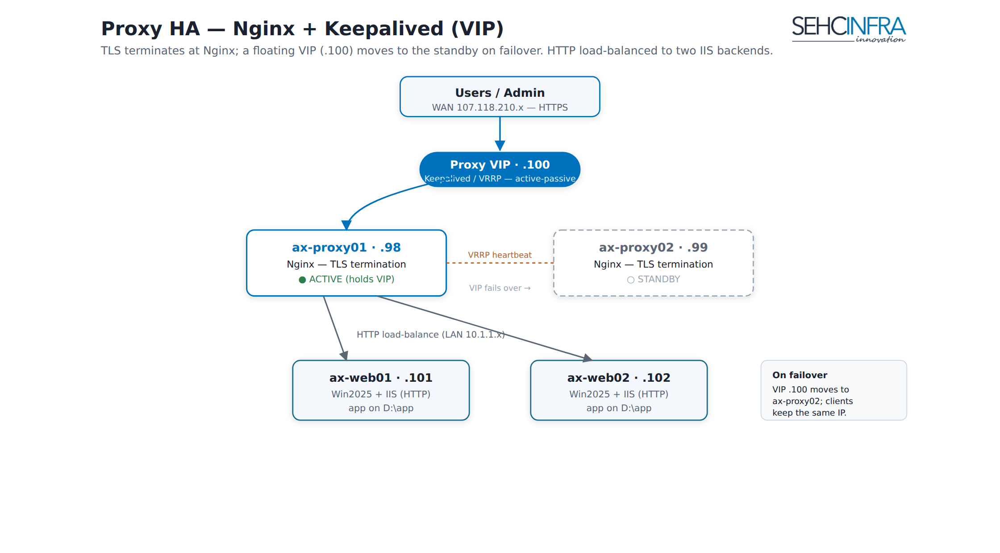

# AX Svr — Proxy HA (Nginx + Keepalived/VIP)

Two Nginx reverse proxies sit in front of the two IIS web backends in an **active-passive** pair, sharing one floating **Proxy-VIP (107.118.210.100)** managed by Keepalived (VRRP). Users hit the VIP over WAN; whichever proxy currently holds the VIP terminates the connection and load-balances it over LAN to the IIS backends. The proxy tier — not IIS — is the natural place to terminate TLS later, since it is the single WAN-facing edge and keeps the internal IIS traffic simple (plain HTTP).

> Source: `docs/axsvr-phase4-proxy.md` — status: HTTP (port 80) load balancing and Keepalived VIP failover are implemented; HTTPS termination at Nginx is documented but **not yet applied** (planned for a later stage).


> **Note for operators:** this diagram is being produced separately — upload the PNG as a Confluence attachment on this page once available.

## Topology

```
User --WAN--> 107.118.210.100 (VIP) --> Nginx ax-proxy01 .98 / ax-proxy02 .99
                                          | LAN
                                          v
                          IIS ax-web01 10.1.1.101:80 / ax-web02 10.1.1.102:80
```

| Host | WAN 107.118.210.x | LAN 10.1.1.x | Role |
|---|---|---|---|
| ax-proxy01 | .98 | .98 | Nginx + Keepalived, **MASTER** (priority 150) |
| ax-proxy02 | .99 | .99 | Nginx + Keepalived, **BACKUP** (priority 100) |
| Proxy-VIP | **.100** | — | Floating VIP, WAN entry point |
| ax-web01 (IIS) | .101 | .101 (receives traffic) | Backend, HTTP only |
| ax-web02 (IIS) | .102 | .102 (receives traffic) | Backend, HTTP only |

**Current stage:** Nginx listens on **port 80 (HTTP) only** and load-balances to the two IIS backends. TLS termination at Nginx (port 443) is a later stage — see [TLS termination (planned)](#tls-termination-planned-not-yet-applied) below.

## Setup (both proxies)

```bash
sudo apt update
sudo apt install -y nginx keepalived

# Identify the NIC on the 107.118.210.x (WAN) range — needed for keepalived:
ip -br a | grep 107.118.210
```

Note the WAN interface name (e.g. `ens3`) — substitute it for `<WAN_IF>` below.

## Nginx reverse proxy + load balancing (HTTP)

Same file on both proxies. Current stage: **HTTP port 80 only, no TLS yet.**

`/etc/nginx/conf.d/ax-web.conf`:
```nginx
upstream ax_web_backend {
    least_conn;
    server 10.1.1.101:80 max_fails=3 fail_timeout=10s;
    server 10.1.1.102:80 max_fails=3 fail_timeout=10s;
    keepalive 32;
}

server {
    listen 80 default_server;
    server_name _;                       # or ax.example.com

    client_max_body_size 50m;

    location / {
        proxy_pass http://ax_web_backend;
        proxy_http_version 1.1;
        proxy_set_header Host              $host;
        proxy_set_header X-Real-IP         $remote_addr;
        proxy_set_header X-Forwarded-For   $proxy_add_x_forwarded_for;
        proxy_set_header X-Forwarded-Proto $scheme;
        proxy_set_header Connection        "";
        proxy_connect_timeout 5s;
        proxy_next_upstream error timeout http_502 http_503 http_504;
    }
}
```

```bash
sudo nginx -t && sudo systemctl enable --now nginx
```

> Nginx uses `listen 80` on **all interfaces** — whichever node currently holds the VIP receives the traffic. Do not bind to the VIP address explicitly, or the backup node will fail to start when it doesn't own the VIP.

**Warning:** the `107.118.210.x` range is WAN, so HTTP traffic (including login/session data) travels **in cleartext** and is exposed to eavesdropping/MITM. This is acceptable for the current test stage only; production should enable HTTPS (see below).

## TLS termination (planned, not yet applied)

When HTTPS is enabled, the `server` block above is replaced by the two blocks below (redirect 80→443, terminate TLS at 443):

```nginx
# HTTP -> HTTPS
server {
    listen 80 default_server;
    server_name _;
    return 301 https://$host$request_uri;
}

server {
    listen 443 ssl;
    http2 on;
    server_name ax.example.com;          # replace with the real domain

    ssl_certificate     /etc/nginx/ssl/ax.crt;
    ssl_certificate_key /etc/nginx/ssl/ax.key;
    ssl_protocols       TLSv1.2 TLSv1.3;
    ssl_ciphers         HIGH:!aNULL:!MD5;
    ssl_prefer_server_ciphers on;

    # Security headers
    add_header Strict-Transport-Security "max-age=31536000; includeSubDomains" always;
    add_header X-Content-Type-Options "nosniff" always;
    add_header X-Frame-Options "DENY" always;
    add_header Referrer-Policy "strict-origin-when-cross-origin" always;

    client_max_body_size 50m;

    location / {
        proxy_pass http://ax_web_backend;
        proxy_http_version 1.1;
        proxy_set_header Host              $host;
        proxy_set_header X-Real-IP         $remote_addr;
        proxy_set_header X-Forwarded-For   $proxy_add_x_forwarded_for;
        proxy_set_header X-Forwarded-Proto $scheme;
        proxy_set_header Connection        "";
        proxy_connect_timeout 5s;
        proxy_next_upstream error timeout http_502 http_503 http_504;
    }
}
```

**Certificate:** if a public domain is available, use Let's Encrypt; if internal-only, use an internal CA or a self-signed cert:
```bash
sudo mkdir -p /etc/nginx/ssl
# temporary self-signed (replace with a real cert for production):
sudo openssl req -x509 -nodes -days 365 -newkey rsa:2048 \
  -keyout /etc/nginx/ssl/ax.key -out /etc/nginx/ssl/ax.crt \
  -subj "/CN=ax.example.com"
```
> Both proxies must use the **same certificate** (copy it identically to both nodes).

## Keepalived (VRRP) — Proxy-VIP 107.118.210.100

**Nginx health-check script** (both proxies) — `/etc/keepalived/check_nginx.sh`:
```bash
#!/bin/bash
systemctl is-active --quiet nginx
```
```bash
sudo chmod +x /etc/keepalived/check_nginx.sh
```

**ax-proxy01 (MASTER)** — `/etc/keepalived/keepalived.conf`:
```conf
vrrp_script chk_nginx {
    script "/etc/keepalived/check_nginx.sh"
    interval 2
    weight -40            # nginx down -> lower priority -> release VIP
    fall 2
    rise 2
}

vrrp_instance AX_PROXY {
    state MASTER
    interface <WAN_IF>        # NIC on the 107.118.210.x range
    virtual_router_id 51
    priority 150              # higher on MASTER
    advert_int 1
    authentication {
        auth_type PASS
        auth_pass <SHARED_SECRET>   # must match on both nodes
    }
    virtual_ipaddress {
        107.118.210.100/24
    }
    track_script {
        chk_nginx
    }
}
```

**ax-proxy02 (BACKUP)** — `/etc/keepalived/keepalived.conf` — differs from ax-proxy01 only in `state` (BACKUP) and `priority` (100):
```conf
vrrp_script chk_nginx {
    script "/etc/keepalived/check_nginx.sh"
    interval 2
    weight -40            # nginx down -> lower priority -> release VIP
    fall 2
    rise 2
}

vrrp_instance AX_PROXY {
    state BACKUP
    interface <WAN_IF>        # NIC on the 107.118.210.x range
    virtual_router_id 51       # must match ax-proxy01
    priority 100               # lower than ax-proxy01
    advert_int 1
    authentication {
        auth_type PASS
        auth_pass <SHARED_SECRET>   # must match ax-proxy01
    }
    virtual_ipaddress {
        107.118.210.100/24
    }
    track_script {
        chk_nginx
    }
}
```

```bash
sudo systemctl enable --now keepalived
```

## Params table

| Param | Value | Note |
|---|---|---|
| Proxy-VIP | `107.118.210.100/24` | Floating, WAN-facing; DNS should point here, not at either proxy's real IP |
| `virtual_router_id` | `51` | Must be unique on the network (avoid clashing with another VRRP cluster) |
| MASTER priority | `150` | ax-proxy01 |
| BACKUP priority | `100` | ax-proxy02 |
| `weight` (chk_nginx) | `-40` | Applied when Nginx health check fails, dropping priority below the peer's so the VIP moves |
| `advert_int` | `1` (second) | VRRP advertisement interval |
| `fall` / `rise` | `2` / `2` | Health-check consecutive fail/pass counts before state change |
| Upstream LB method | `least_conn` | Nginx `upstream` block |
| Upstream health check | `max_fails=3 fail_timeout=10s` | Per backend server |
| `keepalive` (upstream) | `32` | Keepalive connections to backends |
| `proxy_connect_timeout` | `5s` | Nginx to backend |
| `client_max_body_size` | `50m` | Nginx |
| Forwarded headers | `X-Real-IP`, `X-Forwarded-For`, `X-Forwarded-Proto`, `Host` | Set on every proxied request |

## Verification

```bash
# On ax-proxy01, confirm the VIP is present:
ip a | grep 107.118.210.100        # should appear on ax-proxy01 (MASTER)

# From a WAN client:
curl -I http://107.118.210.100     # expect HTTP 200 from the web backend
```

## Failover test (mandatory)

**1) Proxy VM down → VIP moves to the other proxy:**
```bash
sudo systemctl stop keepalived      # on ax-proxy01
# VIP 107.118.210.100 should appear on ax-proxy02 within ~1-3s
ip a | grep 107.118.210.100           # check on ax-proxy02
curl -I http://107.118.210.100        # still reachable
sudo systemctl start keepalived     # bring ax-proxy01 back -> it reclaims the VIP (higher priority)
```

**2) Nginx down (not the whole VM) → chk_nginx forces the VIP to move too:**
```bash
sudo systemctl stop nginx           # on the node currently holding the VIP
# priority drops by -40 -> the other node becomes MASTER, VIP moves over
sudo systemctl start nginx
```

**3) A web backend goes down → Nginx removes it from the pool automatically:**
```bash
# Stop IIS on ax-web01 -> Nginx routes everything to ax-web02, no user-visible interruption (max_fails/fail_timeout)
```

## Important notes

1. **DNS:** the domain name should point at the **Proxy-VIP 107.118.210.100**, not at either proxy's real IP.
2. **Proxy firewall:** at this stage, only port **80** is open from WAN (add 443 once HTTPS is enabled per the TLS section above); only the proxies are allowed to call the web backends over LAN.
3. **Web (IIS) firewall:** only open port 80 to the two proxies (10.1.1.98/.99) over LAN; do **not** expose IIS to WAN.
4. `virtual_router_id` (51) must be **unique** on the network to avoid clashing with any other VRRP cluster.

## Key decisions

- **VIP active-passive (Keepalived/VRRP) vs. active-active or an external LB.** Only one proxy serves traffic at a time, holding the shared VIP; the other stands by and takes over on failure. This was chosen over active-active for simplicity (no need for external DNS-based or anycast load splitting) and over a dedicated hardware/cloud load balancer since the whole stack is self-hosted. Health is tracked via a `chk_nginx` VRRP script (`weight -40`) so a dead Nginx process — not just a dead VM — also triggers failover.
- **TLS terminated at the proxy, not at IIS.** The proxy tier is the single WAN-facing edge, so terminating TLS there (planned, see above) centralizes certificate management on two nodes running the same cert, and keeps IIS/LAN traffic as plain HTTP. The tradeoff, called out explicitly in the source doc, is that until HTTPS is enabled, WAN traffic (107.118.210.x) — including login/session data — travels in cleartext; this is accepted only for the current test stage, not for production.
- **Nginx binds `listen 80` on all interfaces, not the VIP address.** Binding to the VIP directly would prevent the backup node from starting Nginx when it doesn't currently own the VIP; binding to all interfaces lets whichever node holds the VIP simply receive the traffic.

## Related pages

- AX Svr — Architecture overview
- AX Svr — Web tier (IIS)
- AX Svr — Database HA (Patroni)
- AX Svr — Backup & monitoring

---
Paste as Markdown; upload any referenced PNG as a page attachment.
