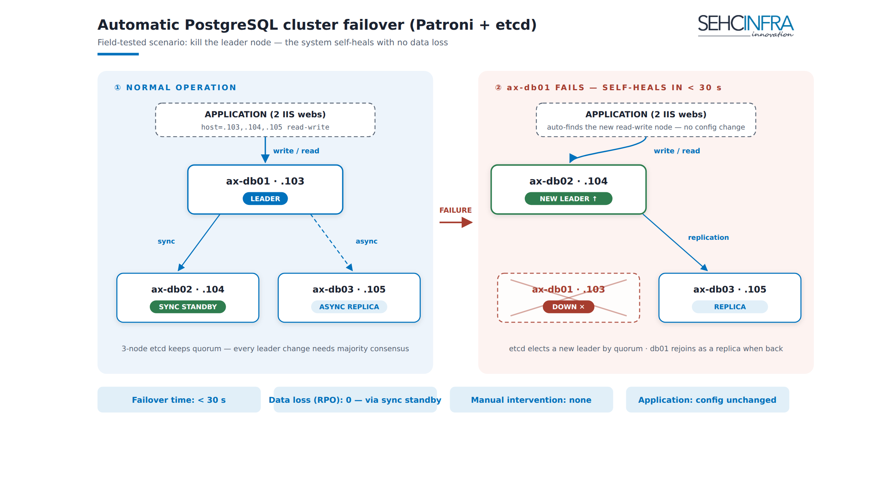

# AX Svr — Database: PostgreSQL 17 HA (etcd + Patroni)

The database tier is a 3-node **PostgreSQL 17** cluster managed by **Patroni**, using a 3-node **etcd** cluster as the Distributed Configuration Store (DCS) for leader election and quorum. Replication is **1 synchronous + 1 asynchronous** standby, with **automatic failover** driven by Patroni/etcd — there is no manual promotion step. The deliberate design choice for this tier is **no HAProxy / no DB virtual IP**: applications connect with a **multi-host connection string** (`target_session_attrs=read-write`) and let the client driver find whichever node is currently primary. All PostgreSQL data and logs live on **`/data/postgresql`**, a disk dedicated to the DB role (separate from the OS disk) so storage and snapshots can be managed independently.

> Source: `docs/axsvr-phase1-db.md` — Status: implemented in production (initial rollout).


*(Operators: upload this PNG as a Confluence page attachment — it already exists in the repo at `docs/images/en/axsvr-db-failover.png`.)*

## 1. Topology

```
ax-db01 10.1.1.103  │  ax-db02 10.1.1.104  │  ax-db03 10.1.1.105
PostgreSQL 17 + Patroni + etcd (every node runs all three components)
Replication: 1 synchronous + 1 asynchronous standby

Per-node disk layout:
  /data/postgresql/17/main   <- data_dir (includes pg_wal)
  /data/postgresql/logs      <- PostgreSQL log files
```

| Node | Role | WAN IP | LAN IP | Notes |
|---|---|---|---|---|
| **ax-db01** | Patroni **Leader** (primary) | `107.118.210.103` | `10.1.1.103` | Bootstraps the cluster first (initdb into `/data`) |
| **ax-db02** | **Sync Standby** | `107.118.210.104` | `10.1.1.104` | `synchronous_node_count: 1` — this is the guaranteed-durable replica |
| **ax-db03** | Async **Replica** | `107.118.210.105` | `10.1.1.105` | Also hosts `/backup` (dedicated disk) for pgBackRest — see Backup page |

Same last octet on WAN and LAN NICs per the standard AX Svr network convention. All three nodes run PostgreSQL 17 (via the PGDG repo), Patroni, and an etcd member — every node is symmetric.

## 2. etcd cluster — 3-node DCS quorum

etcd provides the distributed lock/leader-election backing Patroni. `ETCD_INITIAL_CLUSTER` must list all 3 members identically on every node.

> **Per-node config caveat:** each node has its own complete `/etc/default/etcd` file below — copy-paste the whole block for that node, do not "copy ax-db01's file and edit a couple of lines." The three files differ only in `ETCD_NAME`, `ETCD_LISTEN_*`, and `ETCD_*ADVERTISE*` addresses; everything else must match across all 3 files.

**ax-db01 — `/etc/default/etcd` (10.1.1.103):**
```ini
ETCD_NAME="ax-db01"
ETCD_DATA_DIR="/var/lib/etcd"
ETCD_LISTEN_PEER_URLS="http://10.1.1.103:2380"
ETCD_LISTEN_CLIENT_URLS="http://10.1.1.103:2379,http://127.0.0.1:2379"
ETCD_INITIAL_ADVERTISE_PEER_URLS="http://10.1.1.103:2380"
ETCD_ADVERTISE_CLIENT_URLS="http://10.1.1.103:2379"
ETCD_INITIAL_CLUSTER="ax-db01=http://10.1.1.103:2380,ax-db02=http://10.1.1.104:2380,ax-db03=http://10.1.1.105:2380"
ETCD_INITIAL_CLUSTER_TOKEN="ax-etcd-cluster"
ETCD_INITIAL_CLUSTER_STATE="new"
```

**ax-db02 — `/etc/default/etcd` (10.1.1.104):**
```ini
ETCD_NAME="ax-db02"
ETCD_DATA_DIR="/var/lib/etcd"
ETCD_LISTEN_PEER_URLS="http://10.1.1.104:2380"
ETCD_LISTEN_CLIENT_URLS="http://10.1.1.104:2379,http://127.0.0.1:2379"
ETCD_INITIAL_ADVERTISE_PEER_URLS="http://10.1.1.104:2380"
ETCD_ADVERTISE_CLIENT_URLS="http://10.1.1.104:2379"
ETCD_INITIAL_CLUSTER="ax-db01=http://10.1.1.103:2380,ax-db02=http://10.1.1.104:2380,ax-db03=http://10.1.1.105:2380"
ETCD_INITIAL_CLUSTER_TOKEN="ax-etcd-cluster"
ETCD_INITIAL_CLUSTER_STATE="new"
```

**ax-db03 — `/etc/default/etcd` (10.1.1.105):**
```ini
ETCD_NAME="ax-db03"
ETCD_DATA_DIR="/var/lib/etcd"
ETCD_LISTEN_PEER_URLS="http://10.1.1.105:2380"
ETCD_LISTEN_CLIENT_URLS="http://10.1.1.105:2379,http://127.0.0.1:2379"
ETCD_INITIAL_ADVERTISE_PEER_URLS="http://10.1.1.105:2380"
ETCD_ADVERTISE_CLIENT_URLS="http://10.1.1.105:2379"
ETCD_INITIAL_CLUSTER="ax-db01=http://10.1.1.103:2380,ax-db02=http://10.1.1.104:2380,ax-db03=http://10.1.1.105:2380"
ETCD_INITIAL_CLUSTER_TOKEN="ax-etcd-cluster"
ETCD_INITIAL_CLUSTER_STATE="new"
```

> etcd's own data stays on `/var/lib/etcd` (small — it's the DCS, not DB data), not `/data`. It can be moved to `/data/etcd` if desired but is not required.

**Start (near-simultaneously on all 3 nodes, since `ETCD_INITIAL_CLUSTER_STATE="new"`):**
```bash
sudo systemctl enable --now etcd
etcdctl --endpoints=http://10.1.1.103:2379,http://10.1.1.104:2379,http://10.1.1.105:2379 endpoint health
```

> **Known pitfall:** if `endpoint health` fails and etcd is only listening on `127.0.0.1:2379` (not the LAN IP), it's because the apt package auto-starts etcd with default config the moment it's installed, and `systemctl enable --now` does **not restart** an already-running process — it keeps the stale config, and the data dir was already initialized as the default single member. Fix on **all 3 nodes at roughly the same time**:
> ```bash
> sudo systemctl stop etcd
> sudo rm -rf /var/lib/etcd/*   # wipe the wrongly-initialized member — safe only on a fresh cluster with no real data yet
> sudo systemctl restart etcd
> sudo ss -tlnp | grep 2379     # verify: must show 10.1.1.103:2379 (LAN IP), not just 127.0.0.1
> ```
> If it's still failing, also check `systemctl cat etcd | grep EnvironmentFile` includes `-/etc/default/etcd`.

**Firewall — LAN-only for cluster ports:**

| Port | Purpose | Allowed from |
|---|---|---|
| 5432/tcp | PostgreSQL | `10.1.1.0/24` |
| 8008/tcp | Patroni REST API | `10.1.1.0/24` |
| 2379/tcp | etcd client | `10.1.1.0/24` |
| 2380/tcp | etcd peer | `10.1.1.0/24` |
| 22/tcp | SSH admin (air-gap) | `107.118.210.0/24` |

## 3. Patroni

Patroni owns PostgreSQL's lifecycle: it runs `initdb`, manages `postgresql.conf`/`pg_hba.conf`, and drives automatic failover through the etcd DCS.

> **Per-node config caveat:** each node has its own complete `/etc/patroni/patroni.yml` file below — copy-paste the whole block, do not "copy ax-db01's file and change a few lines." **Only 5 lines differ between the 3 nodes**: `name`, `restapi.listen`/`connect_address`, and `postgresql.listen`/`connect_address`. Everything else — `bootstrap`, `etcd3.hosts`, passwords, `data_dir`, `tags` — **must be identical across all 3 files**. This means if a shared parameter changes later (e.g. `shared_buffers`, `pg_hba`), **all 3 files must be edited**, not just one.

Generate strong passwords once and reuse them identically on all 3 nodes:
```bash
openssl rand -base64 24   # superuser
openssl rand -base64 24   # replicator
```

**ax-db01 — `/etc/patroni/patroni.yml` (10.1.1.103):**
```yaml
scope: ax-pg-cluster
namespace: /service/
name: ax-db01

restapi:
  listen: 10.1.1.103:8008
  connect_address: 10.1.1.103:8008

etcd3:
  hosts:
    - 10.1.1.103:2379
    - 10.1.1.104:2379
    - 10.1.1.105:2379

bootstrap:
  dcs:
    ttl: 30
    loop_wait: 10
    retry_timeout: 10
    maximum_lag_on_failover: 1048576
    synchronous_mode: true
    synchronous_node_count: 1
    postgresql:
      use_pg_rewind: true
      use_slots: true
      parameters:
        max_connections: 200
        shared_buffers: 2GB
        wal_level: replica
        hot_standby: "on"
        max_wal_senders: 10
        max_replication_slots: 10
        wal_keep_size: 1GB
        password_encryption: scram-sha-256
        # --- logs into /data ---
        logging_collector: "on"
        log_directory: "/data/postgresql/logs"
        log_filename: "postgresql-%Y-%m-%d.log"
  initdb:
    - encoding: UTF8
    - data-checksums
  pg_hba:
    - local all all trust
    - host all all 127.0.0.1/32 scram-sha-256
    - host all all 10.1.1.0/24 scram-sha-256              # web app connections
    - host replication replicator 10.1.1.0/24 scram-sha-256

postgresql:
  listen: 10.1.1.103:5432
  connect_address: 10.1.1.103:5432
  data_dir: /data/postgresql/17/main      # <- data on /data
  bin_dir: /usr/lib/postgresql/17/bin
  pgpass: /tmp/pgpass
  authentication:
    superuser:
      username: postgres
      password: "<MK_SUPERUSER>"
    replication:
      username: replicator
      password: "<MK_REPLICATOR>"

tags:
  nofailover: false
  noloadbalance: false
  clonefrom: false
  nosync: false
```

**ax-db02 — `/etc/patroni/patroni.yml` (10.1.1.104):**
```yaml
scope: ax-pg-cluster
namespace: /service/
name: ax-db02

restapi:
  listen: 10.1.1.104:8008
  connect_address: 10.1.1.104:8008

etcd3:
  hosts:
    - 10.1.1.103:2379
    - 10.1.1.104:2379
    - 10.1.1.105:2379

bootstrap:
  dcs:
    ttl: 30
    loop_wait: 10
    retry_timeout: 10
    maximum_lag_on_failover: 1048576
    synchronous_mode: true
    synchronous_node_count: 1
    postgresql:
      use_pg_rewind: true
      use_slots: true
      parameters:
        max_connections: 200
        shared_buffers: 2GB
        wal_level: replica
        hot_standby: "on"
        max_wal_senders: 10
        max_replication_slots: 10
        wal_keep_size: 1GB
        password_encryption: scram-sha-256
        # --- logs into /data ---
        logging_collector: "on"
        log_directory: "/data/postgresql/logs"
        log_filename: "postgresql-%Y-%m-%d.log"
  initdb:
    - encoding: UTF8
    - data-checksums
  pg_hba:
    - local all all trust
    - host all all 127.0.0.1/32 scram-sha-256
    - host all all 10.1.1.0/24 scram-sha-256              # web app connections
    - host replication replicator 10.1.1.0/24 scram-sha-256

postgresql:
  listen: 10.1.1.104:5432
  connect_address: 10.1.1.104:5432
  data_dir: /data/postgresql/17/main      # <- data on /data
  bin_dir: /usr/lib/postgresql/17/bin
  pgpass: /tmp/pgpass
  authentication:
    superuser:
      username: postgres
      password: "<MK_SUPERUSER>"
    replication:
      username: replicator
      password: "<MK_REPLICATOR>"

tags:
  nofailover: false
  noloadbalance: false
  clonefrom: false
  nosync: false
```

**ax-db03 — `/etc/patroni/patroni.yml` (10.1.1.105):**
```yaml
scope: ax-pg-cluster
namespace: /service/
name: ax-db03

restapi:
  listen: 10.1.1.105:8008
  connect_address: 10.1.1.105:8008

etcd3:
  hosts:
    - 10.1.1.103:2379
    - 10.1.1.104:2379
    - 10.1.1.105:2379

bootstrap:
  dcs:
    ttl: 30
    loop_wait: 10
    retry_timeout: 10
    maximum_lag_on_failover: 1048576
    synchronous_mode: true
    synchronous_node_count: 1
    postgresql:
      use_pg_rewind: true
      use_slots: true
      parameters:
        max_connections: 200
        shared_buffers: 2GB
        wal_level: replica
        hot_standby: "on"
        max_wal_senders: 10
        max_replication_slots: 10
        wal_keep_size: 1GB
        password_encryption: scram-sha-256
        # --- logs into /data ---
        logging_collector: "on"
        log_directory: "/data/postgresql/logs"
        log_filename: "postgresql-%Y-%m-%d.log"
  initdb:
    - encoding: UTF8
    - data-checksums
  pg_hba:
    - local all all trust
    - host all all 127.0.0.1/32 scram-sha-256
    - host all all 10.1.1.0/24 scram-sha-256              # web app connections
    - host replication replicator 10.1.1.0/24 scram-sha-256

postgresql:
  listen: 10.1.1.105:5432
  connect_address: 10.1.1.105:5432
  data_dir: /data/postgresql/17/main      # <- data on /data
  bin_dir: /usr/lib/postgresql/17/bin
  pgpass: /tmp/pgpass
  authentication:
    superuser:
      username: postgres
      password: "<MK_SUPERUSER>"
    replication:
      username: replicator
      password: "<MK_REPLICATOR>"

tags:
  nofailover: false
  noloadbalance: false
  clonefrom: false
  nosync: false
```

**Systemd unit** `/etc/systemd/system/patroni.service` (identical on all 3 nodes):
```ini
[Unit]
Description=Patroni PostgreSQL HA
After=network.target etcd.service
Wants=network-online.target

[Service]
Type=simple
User=postgres
Group=postgres
ExecStart=/usr/bin/patroni /etc/patroni/patroni.yml
Restart=on-failure
RestartSec=5
KillMode=process
TimeoutSec=60

[Install]
WantedBy=multi-user.target
```

## 4. Startup order (matters)

```bash
# STEP 1: ax-db01 ONLY — initdb into /data and become the first Leader
sudo systemctl enable --now patroni        # ax-db01
patronictl -c /etc/patroni/patroni.yml list   # wait ~20s

# STEP 2: only after ax-db01 is Leader, start ax-db02 then ax-db03
sudo systemctl enable --now patroni        # ax-db02
sudo systemctl enable --now patroni        # ax-db03
```

**Expected result:**
```
+ Cluster: ax-pg-cluster ------+--------------+---------+----+-----------+
| Member  | Host       | Role         | State   | TL | Lag in MB |
| ax-db01 | 10.1.1.103 | Leader       | running |  1 |           |
| ax-db02 | 10.1.1.104 | Sync Standby | running |  1 |         0 |
| ax-db03 | 10.1.1.105 | Replica      | running |  1 |         0 |
```

Verify data/logs really landed on `/data`:
```bash
psql -h 10.1.1.103 -U postgres -c "SHOW data_dir;"      # /data/postgresql/17/main
psql -h 10.1.1.103 -U postgres -c "SHOW log_directory;" # /data/postgresql/logs
```

## 5. Failover test (mandatory before go-live)

```bash
psql -h 10.1.1.103 -U postgres -c "CREATE TABLE t(id int); INSERT INTO t VALUES(1);"
sudo systemctl stop patroni       # on ax-db01 (current Leader)
patronictl -c /etc/patroni/patroni.yml list   # ~15-30s later: new Leader elected
psql -h 10.1.1.104 -U postgres -c "INSERT INTO t VALUES(2); SELECT * FROM t;"
sudo systemctl start patroni      # ax-db01 rejoins as Replica (via pg_rewind)
patronictl list
```

## 6. Application connection (multi-host, no HAProxy/VIP)

```text
Host=10.1.1.103,10.1.1.104,10.1.1.105;Port=5432;Database=<db>;
Username=<user>;Password=<pwd>;Target Session Attributes=read-write
```

The driver probes all 3 hosts and connects to whichever one currently accepts read-write (the Leader). After a failover, new connections automatically land on the new primary — **do not hardcode a single IP.**

## Key decisions

- **Patroni + etcd (3-node DCS quorum) over alternatives** — chosen for automatic failover with a proper quorum-based consensus store, instead of a manual/scripted failover approach (e.g. repmgr without auto-promotion) that would need an operator to intervene during an outage.
- **Multi-host connection string over HAProxy / DB virtual IP** — the driver-level `target_session_attrs=read-write` approach removes an extra load-balancer tier (and its own failover problem) from the DB path. Trade-off: this depends on the application driver supporting multi-host + `target_session_attrs`; it was accepted because the web tier's driver supports it.
- **1 synchronous + 1 asynchronous replica, not 2 sync or 2 async** — the sync replica (`ax-db02`, `synchronous_node_count: 1`) guarantees zero data loss on failover to it; the async replica (`ax-db03`) avoids forcing every commit to wait on two remote acks, and doubles as the dedicated backup host (`/backup`, separate disk) without adding synchronous-commit latency risk.

## Related pages

- Architecture overview (edge/proxy + web + DB topology)
- Backup & DR (pgBackRest on `ax-db03` `/backup`)
- Network & firewall (`ufw` rules per role)
- Schema-per-app permission model (`db-scripts` / `axdb.sh`)

---
Paste as Markdown; upload any referenced PNG as a page attachment.
