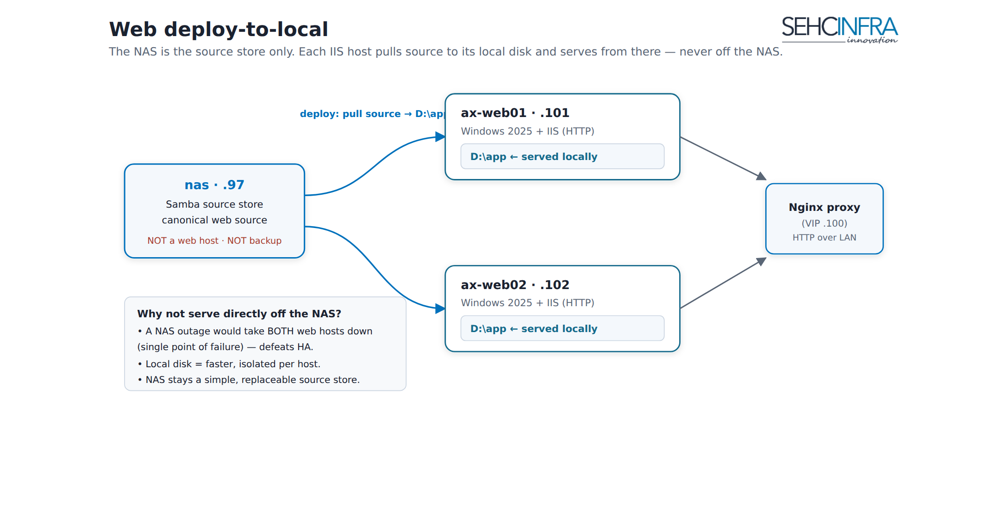

# AX Svr — Web (Windows Server 2025 + IIS)

Two Windows Server 2025 hosts run IIS to serve the app (React/SPA, and an ASP.NET Core API if the backend is .NET). The app binaries are deployed to **local disk `D:\app`** on each host — the NAS (Phase 2) only holds the canonical source/build artifacts and is pulled down on each release; IIS itself never serves directly off the NAS. TLS is terminated upstream at the Nginx proxy (Phase 4), so IIS listens on **plain HTTP** on the LAN only, and the app must trust `X-Forwarded-*` headers to know the real client and scheme.

> Source: `docs/axsvr-phase3-web-iis.md` (Vietnamese, engineer runbook). Status: production deployed — both `ax-web01` and `ax-web02` are live behind the proxy VIP.


> Diagram is produced separately — upload the PNG above as a Confluence page attachment once available.

```
Nginx (10.1.1.98 / .99) ──HTTP──► IIS bind 10.1.1.101:80 / 10.1.1.102:80  (physical path D:\app)
```

---

## Params table

| Param | Value | Note |
|---|---|---|
| Host 1 | `ax-web01` | WAN `107.118.210.101` / LAN `10.1.1.101` |
| Host 2 | `ax-web02` | WAN `107.118.210.102` / LAN `10.1.1.102` |
| OS | Windows Server 2025 | |
| App Pool | `AXPool` | .NET CLR = "No Managed Code"; `startMode = AlwaysRunning` |
| Site name | `AXWeb` | |
| Physical path | `D:\app` | **Local disk**, never a UNC path |
| Site binding | LAN IP only, port 80 | e.g. `10.1.1.101:80` — no WAN binding, ever |
| Health file | `D:\app\health.html` → `OK` | polled by Nginx passive check |
| Rewrite module | URL Rewrite Module | required for SPA fallback rule |
| Backend runtime (if ASP.NET Core) | .NET Hosting Bundle | confirm with web engineer whether backend is .NET Core |

---

## 1. Prerequisites (recap from Phase 0)

```powershell
Install-WindowsFeature -Name Web-Server -IncludeManagementTools
# If the backend is ASP.NET Core: also install the .NET Hosting Bundle
# (confirm with the web engineer whether this applies)
```

Also install the **URL Rewrite Module** (required for SPA routing) — download from Microsoft, or via Web Platform Installer.

---

## 2. App Pool + Site setup (PowerShell)

```powershell
Import-Module WebAdministration

# Remove Default Web Site so it doesn't hold port 80
Remove-Website -Name "Default Web Site" -ErrorAction SilentlyContinue

# App Pool
New-WebAppPool -Name "AXPool"
# Static React build -> "No Managed Code". ASP.NET Core in-process also leaves this empty
# (the Hosting Bundle handles the CLR).
Set-ItemProperty IIS:\AppPools\AXPool -Name managedRuntimeVersion -Value ""
Set-ItemProperty IIS:\AppPools\AXPool -Name autoStart -Value $true
Set-ItemProperty IIS:\AppPools\AXPool -Name startMode -Value "AlwaysRunning"   # reduces cold start

# Site: bind ONLY on the LAN IP, NEVER on WAN. Run the matching block on each web host:

# --- ax-web01 (10.1.1.101) ---
New-Website -Name "AXWeb" -PhysicalPath "D:\app" -ApplicationPool "AXPool" `
  -IPAddress "10.1.1.101" -Port 80

# --- ax-web02 (10.1.1.102) ---
New-Website -Name "AXWeb" -PhysicalPath "D:\app" -ApplicationPool "AXPool" `
  -IPAddress "10.1.1.102" -Port 80
```

> **Never** add a binding on `107.118.210.<n>` (WAN).

---

## 3. web.config — SPA routing, security headers, cache

Place at `D:\app\web.config` (the web engineer usually ships this with the build; use this template if not):

```xml
<?xml version="1.0" encoding="UTF-8"?>
<configuration>
  <system.webServer>

    <!-- React SPA: any route that isn't a real file/folder -> index.html -->
    <rewrite>
      <rules>
        <rule name="SPA Fallback" stopProcessing="true">
          <match url=".*" />
          <conditions logicalGrouping="MatchAll">
            <add input="{REQUEST_FILENAME}" matchType="IsFile"      negate="true" />
            <add input="{REQUEST_FILENAME}" matchType="IsDirectory" negate="true" />
            <add input="{REQUEST_URI}" pattern="^/api/" negate="true" />
          </conditions>
          <action type="Rewrite" url="/index.html" />
        </rule>
      </rules>
    </rewrite>

    <!-- Static compression -->
    <urlCompression doStaticCompression="true" doDynamicCompression="true" />

    <!-- Cache hashed assets (js/css/img); do NOT cache index.html -->
    <staticContent>
      <clientCache cacheControlMode="UseMaxAge" cacheControlMaxAge="365.00:00:00" />
    </staticContent>

    <httpProtocol>
      <customHeaders>
        <remove name="X-Powered-By" />
        <add name="X-Content-Type-Options" value="nosniff" />
      </customHeaders>
    </httpProtocol>

  </system.webServer>
</configuration>
```

> `index.html` should **not** be cached for long — give it its own `no-cache` header (the web engineer configures this in the build), otherwise users get stuck on a stale bundle after each deploy.

---

## 4. Health endpoint for Nginx

```powershell
Set-Content -Path "D:\app\health.html" -Value "OK"
```

- Nginx (Phase 4) currently uses a **passive check** (`max_fails` / `fail_timeout`) — sufficient for a baseline.
- Advanced (active check): if using Nginx Plus or an extra module, point the health check at `/health.html`. With open-source Nginx, an external script can poll `http://10.1.1.101/health.html` and alert (see Phase 6).

---

## 5. Forwarded headers (important for the backend)

TLS terminates at Nginx, so IIS/the app sees the request as plain HTTP. For the app to know the **real client IP and HTTPS scheme**:

- Nginx already sends `X-Forwarded-For`, `X-Forwarded-Proto`, `X-Real-IP` (Phase 4).
- **ASP.NET Core:** the web engineer must enable the `ForwardedHeaders` middleware (`UseForwardedHeaders`) so `Request.Scheme == https` and the client IP resolve correctly. → **Tell the web engineer explicitly.**

---

## 6. Verification

```powershell
# On the web host itself:
curl http://10.1.1.101/health.html        # expect OK
curl http://10.1.1.101/                    # expect the React index page

# From the proxy (LAN) to both web hosts:
curl http://10.1.1.101/ ; curl http://10.1.1.102/
```

Then test through the VIP (Phase 4): `https://107.118.210.100` should serve the site; taking one web host down should not interrupt service.

---

## Key decisions

**Run the app from local `D:\app`, not directly off the NAS.**

| | Deploy-to-local (chosen) | IIS physical path = NAS UNC (rejected) |
|---|---|---|
| NAS outage | Web hosts keep serving the last deployed build | Both web hosts go down — NAS becomes a single point of failure |
| Latency | Reads from local disk, no per-request SMB hop | Every request round-trips over SMB |
| File locking / permissions | None of IIS-over-UNC's lock/permission quirks | App Pool identity needs share permissions; UNC file locks can misbehave under IIS |
| Cost | Requires an explicit deploy/sync step (`robocopy`, manual or CI/CD) per release | "Update once, both hosts see it" — but at the cost of the SPOF above |

Deploy-to-local was chosen deliberately: the NAS is a **source/artifact store only**, pulled to `D:\app` on each release (see Phase 2 for the `deploy.ps1` / robocopy flow). IIS physical path must always be `D:\app`, **never** a `\\10.1.1.97\...` UNC path.

---

## Checklist

- [ ] IIS + URL Rewrite installed; Default Web Site removed
- [ ] `AXPool` App Pool (AlwaysRunning); site bound to **LAN IP:80 only**
- [ ] Physical path = `D:\app` (local, not UNC)
- [ ] `web.config` has SPA fallback + cache + security headers
- [ ] `health.html` returns OK
- [ ] Firewall allows only the proxy hosts (.98/.99) to reach port 80
- [ ] Web engineer confirmed to enable `ForwardedHeaders`
- [ ] Both web hosts identical; verified through the VIP

---

## Related pages

- AX Svr — Infrastructure Overview
- AX Svr — NAS / Source Store & Deploy (Phase 2)
- AX Svr — Proxy HA (Phase 4)
- AX Svr — PostgreSQL HA (Phase 1)

---

Paste as Markdown; upload any referenced PNG as a page attachment.
