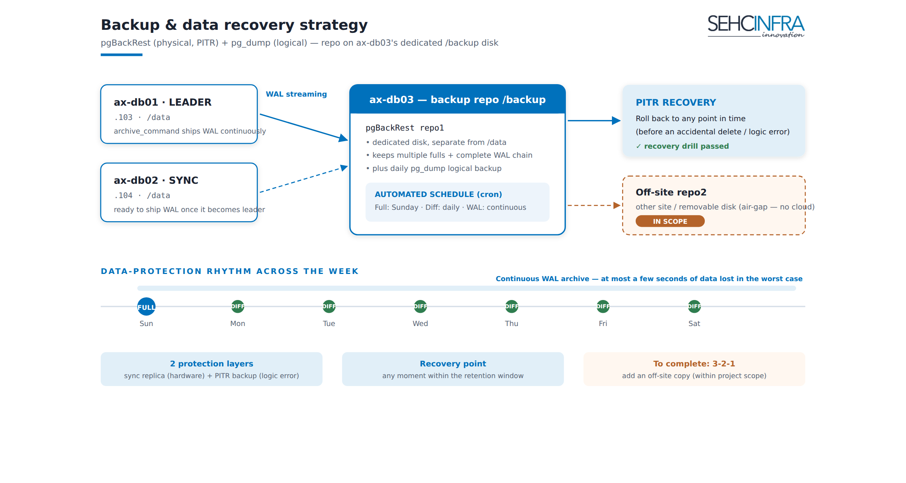

# AX Svr — Backup: pgBackRest (Plan B) + Off-site (3-2-1)

PostgreSQL 17 backup for the AX cluster is built on **pgBackRest**, with the repository living on **`/backup` of ax-db03 (10.1.1.105)** — a dedicated disk, physically separate from the `/data` disk that holds the live cluster data (`/data/postgresql/17/main`). DB3 plays a dual role: it is a cluster node **and** the pgBackRest repository host (repo1, local). A daily `pg_dump`/`pg_dumpall` logical layer runs alongside it on the same disk for fast single-table/single-DB recovery. Because the repo sits on a node of the cluster it is protecting, an **off-site second repository (repo2, cloud S3 or remote SSH host)** is added to complete a proper 3-2-1 backup posture.

> **Source docs:** `docs/axsvr-phase5-backup.md` (Phase 5 — pgBackRest Plan B) and `docs/axsvr-backup-offsite.md` (off-site / 3-2-1 completion). Status: Plan B repo1 design finalized; off-site repo2 is the recommended next step, not yet confirmed deployed.


*(Operators: upload `axsvr-backup.png` as a Confluence page attachment so the embed above resolves.)*

> ⚠️ **RISK WARNING — Plan B**
> The backup repository lives **on ax-db03 itself — a member of the cluster it backs up**. This means:
> - ✅ **Covered:** accidental `DROP`/`DELETE`, logical corruption, fast restore, point-in-time recovery (PITR).
> - ❌ **NOT covered:** if ax-db03 (VM/host/disk) fails, **the entire backup is lost with it**. A full-site disaster loses everything.
>
> This is an accepted risk of choosing Plan B. **Strong recommendation:** add an off-site copy (cloud or a different NAS/site) as soon as possible to reach 3-2-1 (see the off-site section below). `/backup` must be on a **different physical disk/reliability domain** than DB3's `/data` disk — never the same drive, or a single disk failure takes out both copies at once.

---

## Topology

```
        WAL archive (SSH)                    backup pull (SSH)
DB1 .103 ──────────────►                   ◄──────────────
DB2 .104 ──────────────►   DB3 .105  (repo1 local /backup/pgbackrest)
DB3 .105 ──(local)─────►   + pg_dump logic /backup/pgdump
                                    │
                                    └──► repo2 (off-site: S3 / remote SSH) — 3-2-1 completion
```

| Node | Role | pgBackRest config |
|---|---|---|
| ax-db01 (10.1.1.103) | Cluster node | `repo1-host=10.1.1.105` (remote repo) |
| ax-db02 (10.1.1.104) | Cluster node | `repo1-host=10.1.1.105` (remote repo) |
| ax-db03 (10.1.1.105) | Cluster node **+ repo1 host** | `repo1-path=/backup/pgbackrest` (local) |

---

## Preparation

Install the **same pgBackRest version on all 3 DB nodes** (already done in Phase 0/1):

```bash
pgbackrest version    # must match across all 3 nodes
```

On DB3 — dedicated `/backup` partition + repo directories (owner `postgres`):

```bash
# assumes /backup is already mounted as its own partition, on a DIFFERENT disk than /data
sudo mkdir -p /backup/pgbackrest /backup/pgdump /backup/scripts /var/log/pgbackrest
sudo chown -R postgres:postgres /backup /var/log/pgbackrest
sudo chmod 750 /backup/pgbackrest
```

### Passwordless SSH between nodes (user `postgres`)

Uses the `postgres` OS user directly (repo and PostgreSQL share one user). Required pairs:
- `postgres@DB1` ↔ `postgres@DB3`
- `postgres@DB2` ↔ `postgres@DB3`

```bash
# on each DB node, if no key exists yet:
sudo -u postgres ssh-keygen -t ed25519 -N "" -f ~postgres/.ssh/id_ed25519
sudo -u postgres cat ~postgres/.ssh/id_ed25519.pub
```

```bash
# on DB3: add pubkeys of postgres@DB1 and postgres@DB2
sudo -u postgres tee -a ~postgres/.ssh/authorized_keys <<'EOF'
<pubkey postgres@db1>
<pubkey postgres@db2>
EOF
# on DB1 and DB2: add pubkey of postgres@DB3
sudo -u postgres tee -a ~postgres/.ssh/authorized_keys <<'EOF'
<pubkey postgres@db3>
EOF
sudo -u postgres chmod 600 ~postgres/.ssh/authorized_keys
```

```bash
# test — must NOT prompt for a password
sudo -u postgres ssh postgres@10.1.1.105 hostname    # from DB1/DB2
sudo -u postgres ssh postgres@10.1.1.103 hostname    # from DB3
```

Firewall: SSH (22) already open within the LAN since Phase 0.

---

## pgBackRest configuration

**On DB3 (repo host)** — `/etc/pgbackrest/pgbackrest.conf`:

```ini
[global]
repo1-path=/backup/pgbackrest
repo1-retention-full=2
repo1-retention-diff=6
repo1-bundle=y
repo1-block=y
process-max=4
start-fast=y
compress-type=zst
compress-level=3
log-level-console=info
log-level-file=detail
backup-standby=y          # prefer copying from a standby, reduces load on the primary

[ax]
pg1-host=10.1.1.103
pg1-host-user=postgres
pg1-path=/data/postgresql/17/main
pg2-host=10.1.1.104
pg2-host-user=postgres
pg2-path=/data/postgresql/17/main
pg3-path=/data/postgresql/17/main        # DB3 local — no host needed
```

**On DB1 and DB2 (repo is remote, on DB3)** — `/etc/pgbackrest/pgbackrest.conf`:

```ini
[global]
repo1-host=10.1.1.105
repo1-host-user=postgres
process-max=4
compress-type=zst
log-level-console=info
log-level-file=detail

[ax]
pg1-path=/data/postgresql/17/main
```

### Enable `archive_command` via Patroni (cluster-wide)

```bash
patronictl -c /etc/patroni/patroni.yml edit-config
```

Add under `postgresql.parameters`:

```yaml
postgresql:
  parameters:
    archive_mode: "on"
    archive_command: 'pgbackrest --stanza=ax archive-push %p'
    archive_timeout: 60
```

> Each node reads its own local config: DB1/DB2 push WAL to DB3 over SSH; DB3 writes WAL to the local repo. `archive_mode: on` requires a restart — roll node by node:
```bash
patronictl -c /etc/patroni/patroni.yml restart ax-pg-cluster --pending
```

### Create the stanza + first backup (run on DB3)

```bash
sudo -u postgres pgbackrest --stanza=ax stanza-create
sudo -u postgres pgbackrest --stanza=ax check          # confirms archiving + repo are OK
sudo -u postgres pgbackrest --stanza=ax --type=full backup
sudo -u postgres pgbackrest --stanza=ax info
```

---

## Schedule & parameters (DB < 100 GB)

| Job | Schedule (cron on DB3) | Type | Purpose |
|---|---|---|---|
| Full backup | `0 1 * * 0` (Sunday 01:00) | `pgbackrest --stanza=ax --type=full backup` | Weekly full |
| Differential backup | `0 1 * * 1-6` (Mon–Sat 01:00) | `pgbackrest --stanza=ax --type=diff backup` | Daily diff on `/backup` |
| WAL archiving | continuous (not cron) | `archive-push` via `archive_command` | Enables PITR to any second |
| Logical dump (`pg_dump`) | `0 2 * * *` (daily 02:00) | `/backup/scripts/daily-dump.sh` | Per-DB logical recovery layer, 7-day retention |

```cron
# on DB3, crontab -u postgres -e
0 1 * * 0  pgbackrest --stanza=ax --type=full backup
0 1 * * 1-6 pgbackrest --stanza=ax --type=diff backup
```

### Daily logical dump (`pg_dump`, cushions against logical errors)

`/backup/scripts/daily-dump.sh`:

```bash
#!/bin/bash
set -euo pipefail
DEST=/backup/pgdump
DATE=$(date +%F)
mkdir -p "$DEST"
# runs on DB3 (usually a replica) — connects via local DB
pg_dumpall -h 127.0.0.1 -U postgres --globals-only | gzip > "$DEST/globals-$DATE.sql.gz"
for db in $(psql -h 127.0.0.1 -U postgres -tAc \
   "SELECT datname FROM pg_database WHERE datistemplate=false AND datname<>'postgres'"); do
   pg_dump -h 127.0.0.1 -U postgres -Fc "$db" > "$DEST/$db-$DATE.dump"
done
find "$DEST" -type f -mtime +7 -delete     # keep 7 days
```

```bash
sudo chown postgres:postgres /backup/scripts/daily-dump.sh
sudo chmod 750 /backup/scripts/daily-dump.sh
```

```cron
0 2 * * *  /backup/scripts/daily-dump.sh >> /backup/dump.log 2>&1
```

> `-Fc` lets `pg_restore` selectively restore individual tables. Note: `pg_dump` reads from DB3 (replica) — no extra load on the primary.

### Storage sizing for `/backup`

`/backup` holds **both the pgBackRest repo and the pg_dump files**:

| Component | Estimate |
|---|---|
| pgBackRest: 2 full backups (~0.35× compression) | ~70 GB |
| 1 week of diffs + WAL archive | ~50 GB |
| pg_dump: 7 copies (~30 GB each) | ~210 GB |
| **Total + headroom** | **provision ~400 GB** |

> To save space: keep only 3–4 days of `pg_dump`, or set `repo1-retention-full=1`. Watch the `DiskAlmostFull` alert (Phase 6 / monitoring page).

---

## Restore / PITR basics

**Restore has not been proven until it has been rehearsed. Drills are mandatory, not optional.**

### A) Physical PITR (pgBackRest)

```bash
# on the node being restored:
sudo systemctl stop patroni
sudo -u postgres rm -rf /data/postgresql/17/main/*
sudo -u postgres pgbackrest --stanza=ax \
  --type=time --target="<YYYY-MM-DD HH:MM:SS>" --delta restore
sudo systemctl start patroni
patronictl -c /etc/patroni/patroni.yml list
```

### B) Logical restore of a single table/DB (from `pg_dump`)

```bash
# selective restore from a .dump file:
pg_restore -h <primary> -U postgres -d <db> -t <table_name> /backup/pgdump/<db>-<date>.dump
```

### Periodic verification (on DB3)

```bash
sudo -u postgres pgbackrest --stanza=ax verify
sudo -u postgres pgbackrest --stanza=ax info
```

---

## Off-site upgrade (repo2) — completing 3-2-1

```
3-2-1 rule:
  3 copies:  production (DB) + /backup (DB3, repo1) + OFF-SITE (repo2)
  2 different storage types
  1 copy geographically elsewhere
```

Today the only backup copy lives on DB3's `/backup` (Plan B) — losing DB3 or the site loses everything. Off-site is the mandatory disaster layer for production.

| Option | When to use |
|---|---|
| **A. Cloud object storage (S3-compatible)** ⭐ recommended | pgBackRest has native S3 support, with its own encryption + retention |
| **B. Server/NAS at another site (via SSH)** | Existing infrastructure at a branch/other DC |
| **C. rclone manual sync** | Simplest — only pushes `pg_dump` files off-site |

### A. pgBackRest repo2 = Cloud S3 (recommended)

pgBackRest supports **multiple repositories**. Keep `repo1` = `/backup` local (as above), add `repo2` = cloud. Every `backup` and every WAL `archive-push` writes to **both repos automatically** → continuous off-site copy, with PITR. S3-compatible: AWS S3, Backblaze B2, Wasabi, MinIO, Cloudflare R2, etc.

Add to `[global]` on DB3, `/etc/pgbackrest/pgbackrest.conf`:

```ini
# ===== repo2: off-site S3 (encrypted) =====
repo2-type=s3
repo2-s3-bucket=<bucket-name>
repo2-s3-endpoint=<s3-endpoint>            # provider-specific, e.g. s3.<region>.backblazeb2.com
repo2-s3-region=<s3-region>
repo2-s3-key=<ACCESS_KEY>
repo2-s3-key-secret=<SECRET_KEY>
repo2-path=/ax
repo2-retention-full=4                     # off-site keeps more history (e.g. 4 weeks)
# --- encryption is REQUIRED for data leaving the premises ---
repo2-cipher-type=aes-256-cbc
repo2-cipher-pass=<STRONG_PASSPHRASE>

# push WAL asynchronously so cloud upload doesn't slow down the DB:
archive-async=y
spool-path=/var/spool/pgbackrest
```

```bash
sudo mkdir -p /var/spool/pgbackrest
sudo chown postgres:postgres /var/spool/pgbackrest
sudo chmod 600 /etc/pgbackrest/pgbackrest.conf     # file contains keys — lock it down
```

> ⚠️ **`repo2-cipher-pass` is the decryption key.** Lose the passphrase and the off-site backup **cannot be restored**. Store it in a separate, secure location (password manager / vault) — never only on DB3.

Init repo2 + test backup:

```bash
# stanza on repo2 (repo1 already exists from the local setup above):
sudo -u postgres pgbackrest --stanza=ax stanza-create
sudo -u postgres pgbackrest --stanza=ax check

# writes to BOTH repos:
sudo -u postgres pgbackrest --stanza=ax --type=full backup

# or target a single repo if needed:
sudo -u postgres pgbackrest --stanza=ax --repo=2 --type=full backup

# view status per repo:
sudo -u postgres pgbackrest --stanza=ax info
```

> No change needed to the cron jobs above — `backup` and `archive-push` handle repo1 + repo2 automatically.

### B. Off-site via server/NAS at another site (SSH)

If infrastructure exists at another branch/DC (e.g. `<remote-ip>`):

```ini
# repo2 on a remote host via SSH
repo2-host=<remote-ip>
repo2-host-user=postgres
repo2-path=/backup/pgbackrest
repo2-retention-full=4
repo2-cipher-type=aes-256-cbc
repo2-cipher-pass=<STRONG_PASSPHRASE>
```

Requires passwordless SSH `postgres@DB3` → `postgres@<remote-ip>` and pgBackRest installed on that host. Pro: data stays on infrastructure you control. Con: depends on link quality between the two sites.

### C. rclone — simple sync (mainly for `pg_dump`)

If you only want to push **`pg_dump`** off-site (light, simple):

```bash
sudo apt install -y rclone
sudo -u postgres rclone config        # create remote "offsite" (S3/Drive/B2...)
```

```cron
30 3 * * *  rclone sync /backup/pgdump offsite:<bucket-or-remote-path> --transfers 4 >> /backup/rclone.log 2>&1
```

> ⚠️ Do **not** rclone the live pgBackRest `repo1` directory directly (risk of copying a state mid-write). For the pgBackRest repo, use **native repo2** (option A/B) — reserve rclone for `pg_dump`.

### Restore FROM off-site (must be rehearsed)

If DB3/the site is lost entirely, restore from repo2 onto a new node:

```bash
# on the target node (pgBackRest installed + same pgbackrest.conf with repo2 + cipher-pass):
sudo systemctl stop patroni
sudo -u postgres rm -rf /data/postgresql/17/main/*
sudo -u postgres pgbackrest --stanza=ax --repo=2 \
  --type=time --target="<YYYY-MM-DD HH:MM:SS>" --delta restore
sudo systemctl start patroni
```

> Test a restore from repo2 **at least once** — to confirm the cipher key/passphrase and cloud connectivity actually work.

### Monitoring (add to Phase 6 / monitoring page)

```yaml
- alert: OffsiteBackupStale
  expr: ax_pgbackrest_repo2_last_backup_age_seconds > 180000   # >50h
  for: 15m
  labels: { severity: critical }
  annotations: { summary: "Off-site backup (repo2) is stale" }
```

Track `pgbackrest info` for **both repos** (textfile collector reads each repo).

### Cost & bandwidth notes

- **Upload bandwidth:** WAL + full/diff pushes to cloud consume upload bandwidth; `archive-async=y` batches WAL without blocking the DB.
- **Cloud cost:** storage + **egress fees on restore** (download). Backblaze B2/Wasabi are cheaper than AWS S3 for large volumes.
- **pgBackRest compression + dedup** significantly reduce storage/bandwidth.
- To save bandwidth, consider sending only **full+diff** off-site (skip continuous WAL) → off-site RPO becomes "last backup" instead of ~1 minute. (Explicit tradeoff.)

### Off-site security checklist

- [ ] `repo2-cipher-pass` stored **separately** from DB3 (vault/password manager)
- [ ] Encryption enabled (`aes-256-cbc`) — data leaving the premises must be encrypted
- [ ] Cloud access key has **least privilege** (read/write to the one bucket only)
- [ ] `pgbackrest.conf` is `chmod 600` (contains keys)
- [ ] Bucket versioning / object-lock enabled where possible (protects against accidental deletes or ransomware)

---

## Key decisions

- **Plan B: repo on DB3's `/backup` vs. a dedicated backup host.** Chosen: put the pgBackRest repo1 and pg_dump on a dedicated `/backup` disk on ax-db03, a cluster node — simpler, no extra host to provision or maintain. Rejected: a standalone backup server, which would remove the single-point-of-failure risk but adds hardware/ops cost. The accepted tradeoff: if DB3 itself (VM/host/disk) is lost, the backup is lost with it — this is the residual risk carried by Plan B and the reason the risk warning is kept prominent on this page.
- **Off-site (repo2) as the 3-2-1 completion, not an afterthought.** Because Plan B puts production and backup on the same node/site, off-site isn't optional hardening — it's what turns the setup into an actual disaster-recovery-capable 3-2-1 design. Cloud S3 (option A) is recommended over remote-SSH (option B) because pgBackRest's native S3 support gives independent encryption/retention without depending on a second self-managed site.
- **`/backup` must be a separate physical disk from `/data`.** A backup repo on the same disk as the data it protects defeats the purpose of Plan B — a single disk failure would take out both copies simultaneously.

---

## Checklist

- [ ] `/backup` is its own partition on DB3, **on a different physical disk than `/data`**
- [ ] Two-way passwordless SSH for `postgres`: DB1↔DB3, DB2↔DB3
- [ ] `stanza-create` + `check` pass
- [ ] First full backup succeeds; `info` shows it
- [ ] `archive_command` enabled via Patroni; WAL from DB1/DB2 reaches DB3
- [ ] Cron jobs in place: full + diff + `pg_dump` on DB3
- [ ] **PITR restore drill done, plus single-table restore from a dump**
- [ ] Off-site destination chosen (A cloud S3 / B remote SSH / C rclone)
- [ ] repo2 configured with encryption; passphrase stored separately and safely
- [ ] `stanza-create` + `check` pass on repo2
- [ ] Full backup written to repo2 (`info` shows both repos)
- [ ] WAL archiving reaches repo2 (`archive-async`)
- [ ] **Off-site restore drill (repo2) done**
- [ ] `/backup` disk-usage alert and `OffsiteBackupStale` alert wired up (Phase 6 / monitoring page)
- [ ] Storage + egress cost estimated

---

## Related pages

- DB Cluster & Replication (Patroni) — cluster nodes this backup protects
- Monitoring & Alerting — disk usage and backup-staleness alerts referenced above
- Network & Foundation Setup — SSH/firewall baseline this page builds on

---

Paste as Markdown; upload any referenced PNG as a page attachment.
