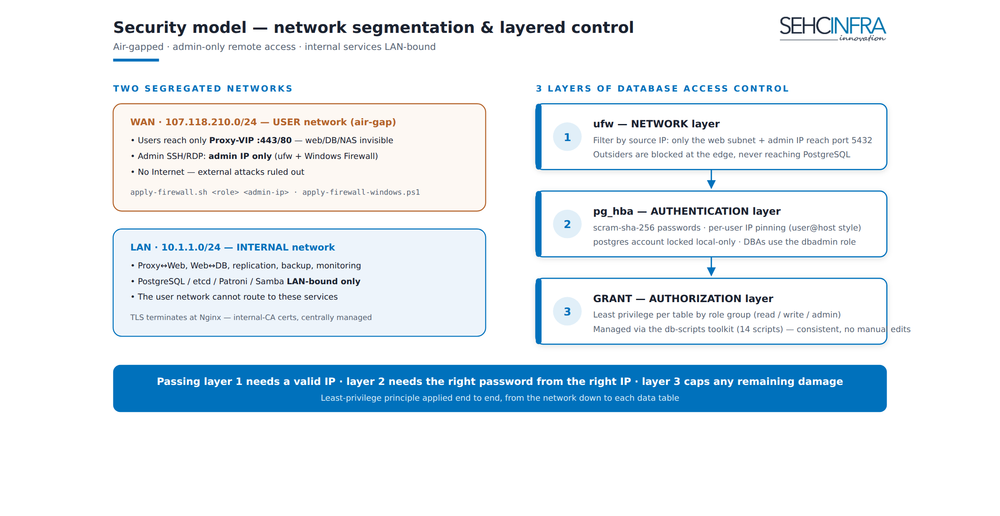

# AX Svr — Security model

The AX Svr platform runs inside an **air-gapped** network (no Internet access) and is designed around one rule: **only administrators may reach any server remotely, and every database connection must pass three independent checks, not one.** Network access is segregated into WAN (user-facing) and LAN (internal — replication, backup, admin), remote administration is locked to admin IPs by role-based firewall scripts, and database access is never granted by a single control — it requires ufw **and** pg_hba **and** GRANT to all agree. This layered approach is deliberate: any single misconfiguration (a stray ufw rule, a leaked password, an over-broad GRANT) is not enough on its own to expose the database.

> Source: `docs/axsvr-phase0-setup.md` (OS hardening + network), `docs/firewall/apply-firewall.sh`, `docs/firewall/apply-firewall-windows.ps1`, `docs/db-scripts/README.md` — status: firewall scripts and the three-layer DB access model are implemented and in use; the air-gap offline APT mirror / internal CA / internal NTP are committed design requirements, documented as an offline path but not yet detailed as a turnkey setup (see §1.1).


> **Note for operators:** upload this PNG as a Confluence attachment on this page.

## 1. Network access model

Two segregated networks: **WAN** `107.118.210.<n>` (user access, admin remote access) and **LAN** `10.1.1.<n>` (replication, backup, internal administration — PostgreSQL, etcd, Patroni, Samba are LAN-bound only). Same last octet on both NICs per server.

### 1.1 Air-gapped production (no Internet)

Production has **no outbound Internet access**. Every installation/operational step that would normally reach the public Internet must instead use an internal, offline equivalent:

| Need | Public equivalent (not available) | Offline equivalent |
|---|---|---|
| OS/package updates | `apt` against public Ubuntu/PGDG mirrors | Offline APT mirror (`<offline-apt-mirror-host>`) |
| TLS certificates | Public CA (Let's Encrypt, etc.) | Internal CA (`<internal-ca-host>`) |
| Time sync | Public NTP pool | Internal NTP server (`<internal-ntp-host>`) |

> This is a committed design requirement (source doc: "every installation guide has an offline path — APT mirror, internal CA, internal NTP"), not yet written up as a single turnkey setup doc. Treat the hostnames above as placeholders for the engineer to supply; do not point production `apt`/NTP/cert issuance at public endpoints.

### 1.2 Admin-only remote access (role-based firewall)

Remote access (SSH on Linux, RDP on Windows) is restricted to admin IPs only, applied by two role-based scripts:

| Script | Platform | Locks down | Usage |
|---|---|---|---|
| `firewall/apply-firewall.sh` | Linux (ufw) | SSH (22) → admin IPs only; role-specific ports (5432, 8008, 2379/2380, 80, 445/139, monitoring exporters) | `sudo ./apply-firewall.sh <role> [admin_ip[,admin_ip2,...]]`<br>`role`: `proxy \| nas \| db \| mon \| devdb` |
| `apply-firewall-windows.ps1` | Windows Server (RDP) | RDP (3389) → admin IPs only; HTTP (80) → the 2 proxy LAN IPs only | `.\apply-firewall-windows.ps1 -AdminIps "107.118.210.50","107.118.210.51"` |

Examples from the scripts:
```bash
# Linux — DB role, single admin IP
sudo ./apply-firewall.sh db 107.118.210.50

# Linux — Proxy role, two admin IPs
sudo ./apply-firewall.sh proxy 107.118.210.50,107.118.210.51
```
```powershell
# Windows — RDP restricted to admin IPs (defaults ProxyLanIps/MonIp can be overridden)
.\apply-firewall-windows.ps1 -AdminIps "107.118.210.50","107.118.210.51"
```

Both scripts reset the firewall to **default deny incoming / allow outgoing**, then open only the ports required for that role — nothing is open by default.

## 2. Database — three layers of control (centerpiece)

Every database connection must pass **all three layers** — this is an **AND**, not an OR. Failing any one layer blocks the connection, even if the other two would have allowed it.

| Layer | Mechanism | Controls |
|---|---|---|
| 1 | **ufw** | Which IP may reach port 5432 at all |
| 2 | **pg_hba** | Which user, from which IP, with which password (authentication) |
| 3 | **GRANT / role membership** | Which schema and which table the authenticated user may actually touch |

Why AND-not-OR matters: a leaked password is useless without also being on an IP that ufw allows *and* pg_hba allows for that user. An IP that's allowed through ufw still can't authenticate without valid pg_hba credentials. And an authenticated user still can't read/write a table without the matching GRANT — so even a valid, correctly-connected role is scoped to only the schema/table it was explicitly granted.

### 2.1 Superuser policy

- The built-in **`postgres`** superuser is **local-only** — never used for remote administration.
- DBAs use a dedicated **`dbadmin`** superuser for remote administration instead.

### 2.2 Per-user IP pinning (MySQL-style `user@host`)

PostgreSQL does not natively bind an IP to a role the way MySQL's `user@host` does — IPs are set in `pg_hba.conf`, not on the account. The `bind-ip` tooling manages this:

| Environment | Script | Mechanism |
|---|---|---|
| DevDB / standalone | `bind-user-ip.sh` | Edits `pg_hba.conf` file directly + reload |
| Production (Patroni cluster) | `bind-user-ip-patroni.sh` | Updates the DCS via `patronictl edit-config` + cluster reload |

```bash
# DevDB / standalone
./bind-user-ip.sh app_svc 10.1.1.101              # app_svc ONLY from this IP
./bind-user-ip.sh dev_a   192.0.2.10,192.0.2.11   # multiple IPs
./bind-user-ip.sh dev_a   --unpin                 # remove pin -> back to the general rule

# Production (run on one DB node — Patroni cluster)
./bind-user-ip-patroni.sh a 1.1.1.1

# via axdb.sh entry point
./axdb.sh bind-ip <user> <ip[,ip2]>
```

> **Do not** use `bind-user-ip.sh` (file edit) on a Patroni cluster — Patroni will overwrite the file. Use the `-patroni` variant for production.
> Unlike MySQL: PostgreSQL is **one role, one password** — the IP restriction lives separately in `pg_hba`. If different passwords per IP are needed, create a separate role per IP.
> How it works under the hood: `bind-user-ip.sh` adds `include_if_exists pg_hba_peruser.conf` at the top of `pg_hba.conf`, writes an `allow <IP> + reject all other IPs` block for that user, then reloads and checks for errors.

## 3. OS hardening (Phase 0)

Applied to every Linux host before any role-specific software is installed:

| Area | Setting |
|---|---|
| SSH (`/etc/ssh/sshd_config.d/99-ax.conf`) | `PermitRootLogin no`; `PasswordAuthentication no` (key-only, after keys are installed); `X11Forwarding no` |
| Time sync | `timedatectl set-ntp true`; verify `timedatectl status \| grep synchronized` → `yes` (required for etcd/Patroni/log consistency — see internal NTP note in §1.1 for air-gap production) |
| Automatic security patching | `unattended-upgrades` installed and configured (`dpkg-reconfigure -plow unattended-upgrades`) |
| Baseline firewall (ufw) | `ufw default deny incoming`; `ufw default allow outgoing`; admin SSH allowed from the WAN admin subnet as a baseline, refined per-role by `apply-firewall.sh` (§1.2) |
| Hostname / `/etc/hosts` | Consistent hostname↔IP mapping across all Linux nodes |

```bash
# SSH hardening
sudo systemctl restart ssh

# Baseline ufw (later replaced/extended by the role-based apply-firewall.sh)
sudo ufw default deny incoming
sudo ufw default allow outgoing
sudo ufw allow from 107.118.210.0/24 to any port 22 proto tcp   # admin SSH (internal air-gap network)
sudo ufw enable
```

## Key decisions

- **Three-layer database access control (ufw → pg_hba → GRANT), AND-not-OR.** Rejected: relying on any single layer (e.g. network isolation alone, or GRANT alone). Chosen because each layer defends against a different failure mode — a firewall misconfiguration, a leaked credential, and an over-broad privilege each get caught by one of the *other* two layers instead of directly exposing data.
- **`postgres` superuser stays local-only; `dbadmin` is the dedicated remote-admin superuser.** Rejected: using the built-in `postgres` account for remote DBA work. Chosen so the well-known, default superuser name is never a valid remote-login target at all — remote administration always goes through a role that can be rotated/revoked independently of the OS-level `postgres` account.
- **Per-user IP pinning via `pg_hba` (MySQL-style `user@host`), not IP-on-account.** PostgreSQL has no native per-account IP binding, so the `bind-ip` tooling manages it in `pg_hba.conf` instead — file-edit mode for DevDB/standalone, DCS-mediated (`patronictl edit-config`) for the production Patroni cluster, since editing the file directly on a Patroni-managed node would be silently overwritten.

## Related pages

- AX Svr — Architecture overview
- AX Svr — Database HA (Patroni)
- AX Svr — Database administration toolkit
- AX Svr — Backup & monitoring

---
Paste as Markdown; upload any referenced PNG as a page attachment.
