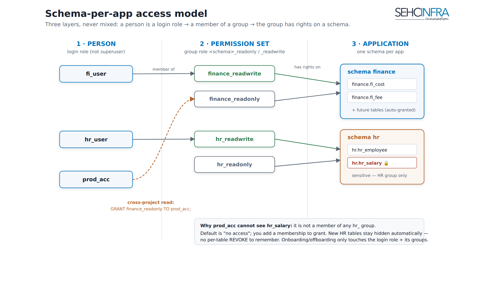

# AX Svr — Database Administration Toolkit

> **Source:** `docs/db-scripts/` (see its `README.md`) · **Status:** In use on DevDB & production; 15-file automated test suite.

A bash toolkit for day-to-day PostgreSQL administration — creating roles, databases, schemas, and (most importantly) managing access under a **schema-per-app** model. Two entry points, same capabilities:

- **`axdb.sh`** — one self-contained script; run with no arguments for an interactive menu, or `axdb.sh <command> [args]`.
- **Standalone scripts** (`create-schema.sh`, `grant-table.sh`, `setup-group-roles.sh`, `grant-group.sh`, …) for scripting/automation.

Both honor a `PSQL_ADMIN` override, so they work locally or remotely:
```bash
# Local on the DB server (default):
sudo -u postgres ./axdb.sh perm AXDEV
# Remote:
export PSQL_ADMIN="psql -h 107.118.210.90 -U dbadmin"
./axdb.sh perm AXDEV
```

## The access model — schema-per-app



> Upload `docs/images/en/axsvr-schema-per-app.png` as a Confluence attachment.

Three layers, never mixed:

```
1 person         = 1 login role (NOT a superuser, no shared accounts)
                     ↓ member of
1 permission set = a group role: <schema>_readonly / <schema>_readwrite
                     ↓ applied to
1 application    = 1 schema (finance, hr, licasi, …)
```

**Rules that make this hold:**

- **One app = one schema.** A schema is a namespace inside the database (the middle tier PostgreSQL has that MySQL does not — MySQL's "schema" *is* a database). Tables are grouped and secured per app instead of piling into `public` with name prefixes.
- **Privileges live on group roles, not individuals.** Onboarding = create a login role + add it to a group. Offboarding = drop the role. Tables and grants are never touched.
- **Always create tables as the schema/DB owner.** `ALTER DEFAULT PRIVILEGES ... FOR ROLE <owner>` only auto-grants future tables to the groups when the owner is the creator. Creating tables as a different role is the #1 cause of "I made a table but nobody can read it."
- **Cross-project access = add a group membership.** e.g. a Production account that needs to read all of Finance: `GRANT finance_readonly TO prod_acc;` — covers existing **and future** Finance tables. Cross-schema queries must qualify the schema: `SELECT * FROM finance.fi_cost;`.
- **Security is "default deny."** A user sees only the schemas whose groups it belongs to. A sensitive table like `hr_salary` stays hidden from Production automatically — there is no per-table REVOKE to remember, and new HR tables stay hidden too.

> **Caveat:** group roles are cluster-global. Reusing the same schema name in two different databases makes them share one group role — fine within one database; qualify group names per-DB if you ever need the same schema name across databases.

## Command reference

| Task | Command |
|------|---------|
| Create an app schema + its RO/RW groups | `./axdb.sh schema <app> <db> [owner]` |
| Create group roles for the whole DB (public model) | `./axdb.sh setup-groups <db> [owner]` |
| Create a login user (optionally in a group) | `./axdb.sh create-user <user> [group]` |
| Add / remove a user to a group | `./axdb.sh grant-group <user> <group>` · `revoke-group` |
| Set a user's search_path (so app code needs no schema prefix) | `./axdb.sh set-search-path <user> <schema>` |
| Grant on a table (auto-grants USAGE on its schema) | `./axdb.sh grant <role> <db> <table> "<privs>"` |
| Revoke a table privilege | `./axdb.sh revoke <role> <db> <table> "<privs>"` |
| Grant / revoke a schema-level privilege (USAGE/CREATE) | `./axdb.sh grant-schema <role> <db> <schema> <priv>` · `revoke-schema` |
| Show who holds USAGE/CREATE on a schema | `./axdb.sh schema-perm <db> <schema>` |
| Permission overview | `./axdb.sh perm <db>` (summary) · `perm <db> <user>` (per-table) |
| List / inspect | `./axdb.sh list ...` · `show dbs\|tables\|schemas\|structure\|owner\|perms` |
| Move a table into a schema (name kept) | `./axdb.sh set-schema <db> <table> <schema>` |
| Rename table / schema / user | `./axdb.sh rename-table` · `rename-schema` · `rename-user` |
| Pin a user to specific IPs | `./axdb.sh bind-ip <user> <ip[,ip2]>` |
| Reset a role's password | `./axdb.sh passwd <role>` |
| Drop schema / user / db (guarded) | `./axdb.sh drop-schema` · `drop-user` · `drop-db` |
| Cluster health (one shot) | `./axdb.sh health [db]` |
| Storage / disk-mount sanity | `./axdb.sh check-storage [db]` |

## Behaviors worth knowing

- **`grant` auto-adds `USAGE` on the target table's schema.** PostgreSQL needs **both** USAGE on the schema *and* a table privilege; without USAGE you get `permission denied for schema x` even though `\dp` shows the grant. `revoke` deliberately **leaves USAGE in place** (the role may still need it for other tables) — cut a whole schema with `REVOKE USAGE ON SCHEMA x FROM role;`.
- **`rename-schema`** also renames its `<name>_readonly/_readwrite` groups and patches the `search_path` of roles that point at the old schema.
- **`rename-user`** also migrates the user's `bind-ip` pg_hba pin (re-pins the new name first, then removes the old block).
- Renames do **not** update application code / connection strings — do that yourself.

## Testing

The toolkit ships an automated test suite (15 files) that runs against an ephemeral **PostgreSQL 17 Docker** container via the `PSQL_ADMIN` override — no local Postgres needed:
```bash
for t in docs/db-scripts/tests/test-*.sh; do bash "$t"; done   # each prints == PASS=n FAIL=0 ==
```

## Related pages
Database HA · Security · Operations

---
*Confluence: paste as Markdown; upload `axsvr-schema-per-app.png` as a page attachment.*
